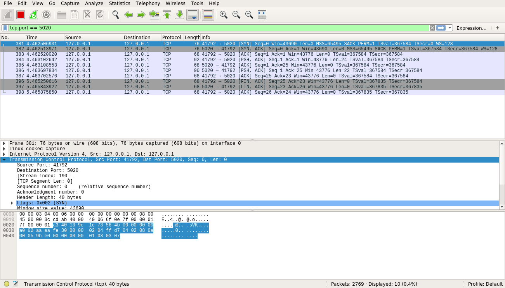
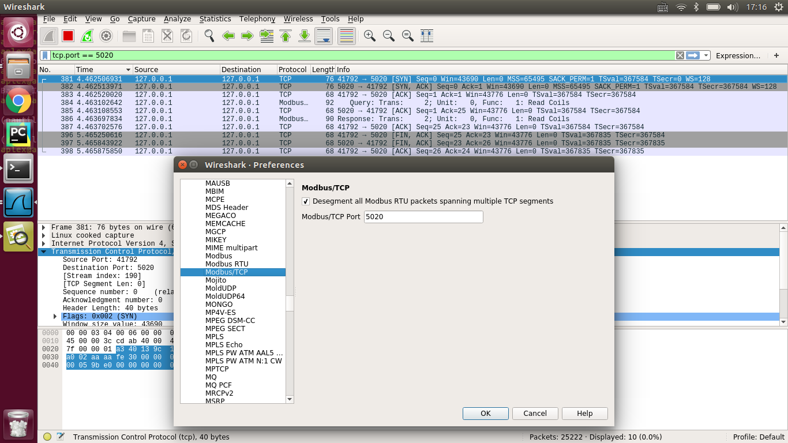
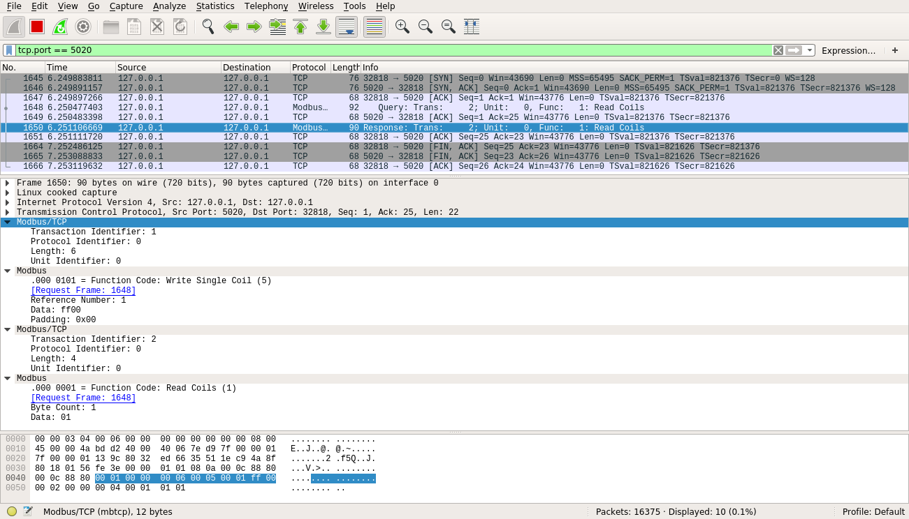

# Ubuntu Modbus TCP

* `Master`是`Client`，`Slave`是`Server`。

## Refers

* [pymodbus Source Code](http://pydoc.net/pymodbus/1.2.0/pymodbus/)
* [client.common — Twisted Async Modbus Client](http://pymodbus.readthedocs.io/en/latest/library/client-common.html)
* [store — Datastore for Modbus Server Context](http://pymodbus.readthedocs.io/en/latest/library/datastore/store.html)
* [pymodbus 試寫 Modbus TCP 程式](http://pymapi.blogspot.jp/2013/11/pymodbus-modbus-tcp.html)
* [Modbus TCP流量分析](http://www.freebuf.com/articles/web/88944.html)
* [Pymodbus Library Examples](http://pymodbus.readthedocs.io/en/latest/examples/index.html)

## Install Plugin

```
sudo apt-get install python-pymodbus
sudo apt-get install python3-twisted
```

## Code

* [code/TCP/asynchronous-client.py](code/TCP/asynchronous-client.py)
* [code/TCP/asynchronous-server.py](code/TCP/asynchronous-server.py)

## Server Output

```
root@localhost:/home/zengjf/Modbus_TCP/docs/code# ./asynchronous-server.py
INFO:pymodbus.server.async:Starting Modbus TCP Server on localhost:5020
DEBUG:pymodbus.server.async:Client Connected [IPv4Address(TCP, '127.0.0.1', 5020)]
DEBUG:pymodbus.server.async:0x0 0x1 0x0 0x0 0x0 0x6 0x0 0x5 0x0 0x1 0xff 0x0 0x0 0x2 0x0 0x0 0x0 0x6 0x0 0x1 0x0 0x1 0x0 0x1 0x0 0x3 0x0 0x0 0x0 0x8 0x0 0xf 0x0 0x1 0x0 0x8 0x1 0xff 0x0 0x4 0x0 0x0 0x0 0x6 0x0 0x1 0x0 0x1 0x0 0x8 0x0 0x5 0x0 0x0 0x0 0x8 0x0 0xf 0x0 0x1 0x0 0x8 0x1 0x0 0x0 0x6 0x0 0x0 0x0 0x6 0x0 0x2 0x0 0x1 0x0 0x8 0x0 0x7 0x0 0x0 0x0 0x6 0x0 0x6 0x0 0x1 0x0 0xa 0x0 0x8 0x0 0x0 0x0 0x6 0x0 0x3 0x0 0x1 0x0 0x1 0x0 0x9 0x0 0x0 0x0 0x17 0x0 0x10 0x0 0x1 0x0 0x8 0x10 0x0 0xa 0x0 0xa 0x0 0xa 0x0 0xa 0x0 0xa 0x0 0xa 0x0 0xa 0x0 0xa 0x0 0xa 0x0 0x0 0x0 0x6 0x0 0x4 0x0 0x1 0x0 0x8 0x0 0xb 0x0 0x0 0x0 0x1b 0x0 0x17 0x0 0x1 0x0 0x8 0x0 0x1 0x0 0x8 0x10 0x0 0x14 0x0 0x14 0x0 0x14 0x0 0x14 0x0 0x14 0x0 0x14 0x0 0x14 0x0 0x14 0x0 0xc 0x0 0x0 0x0 0x6 0x0 0x4 0x0 0x1 0x0 0x8
DEBUG:pymodbus.factory:Factory Request[5]
DEBUG:pymodbus.datastore.context:validate[5] 2:1
DEBUG:pymodbus.datastore.context:setValues[5] 2:1
DEBUG:pymodbus.datastore.context:getValues[5] 2:1
DEBUG:pymodbus.server.async:send: 00010000000600050001ff00
DEBUG:pymodbus.factory:Factory Request[1]
DEBUG:pymodbus.datastore.context:validate[1] 2:1
DEBUG:pymodbus.datastore.context:getValues[1] 2:1
DEBUG:pymodbus.server.async:send: 00020000000400010101
DEBUG:pymodbus.factory:Factory Request[15]
DEBUG:pymodbus.datastore.context:validate[15] 2:8
DEBUG:pymodbus.datastore.context:setValues[15] 2:8
DEBUG:pymodbus.server.async:send: 000300000006000f00010008
DEBUG:pymodbus.factory:Factory Request[1]
DEBUG:pymodbus.datastore.context:validate[1] 2:8
DEBUG:pymodbus.datastore.context:getValues[1] 2:8
DEBUG:pymodbus.server.async:send: 000400000004000101ff
DEBUG:pymodbus.factory:Factory Request[15]
DEBUG:pymodbus.datastore.context:validate[15] 2:8
DEBUG:pymodbus.datastore.context:setValues[15] 2:8
DEBUG:pymodbus.server.async:send: 000500000006000f00010008
DEBUG:pymodbus.factory:Factory Request[2]
DEBUG:pymodbus.datastore.context:validate[2] 2:8
DEBUG:pymodbus.datastore.context:getValues[2] 2:8
DEBUG:pymodbus.server.async:send: 000600000004000201ff
DEBUG:pymodbus.factory:Factory Request[6]
DEBUG:pymodbus.datastore.context:validate[6] 2:1
DEBUG:pymodbus.datastore.context:setValues[6] 2:1
DEBUG:pymodbus.datastore.context:getValues[6] 2:1
DEBUG:pymodbus.server.async:send: 00070000000600060001000a
DEBUG:pymodbus.factory:Factory Request[3]
DEBUG:pymodbus.datastore.context:validate[3] 2:1
DEBUG:pymodbus.datastore.context:getValues[3] 2:1
DEBUG:pymodbus.server.async:send: 000800000005000302000a
DEBUG:pymodbus.factory:Factory Request[16]
DEBUG:pymodbus.datastore.context:validate[16] 2:8
DEBUG:pymodbus.datastore.context:setValues[16] 2:8
DEBUG:pymodbus.server.async:send: 000900000006001000010008
DEBUG:pymodbus.factory:Factory Request[4]
DEBUG:pymodbus.datastore.context:validate[4] 2:8
DEBUG:pymodbus.datastore.context:getValues[4] 2:8
DEBUG:pymodbus.server.async:send: 000a0000001300041000110011001100110011001100110011
DEBUG:pymodbus.factory:Factory Request[23]
DEBUG:pymodbus.datastore.context:validate[23] 2:8
DEBUG:pymodbus.datastore.context:validate[23] 2:8
DEBUG:pymodbus.datastore.context:setValues[23] 2:8
DEBUG:pymodbus.datastore.context:getValues[23] 2:8
DEBUG:pymodbus.server.async:send: 000b0000001300171000140014001400140014001400140014
DEBUG:pymodbus.factory:Factory Request[4]
DEBUG:pymodbus.datastore.context:validate[4] 2:8
DEBUG:pymodbus.datastore.context:getValues[4] 2:8
DEBUG:pymodbus.server.async:send: 000c0000001300041000110011001100110011001100110011
DEBUG:pymodbus.server.async:Client Disconnected: [Failure instance: Traceback (failure with no frames): <class 'twisted.internet.error.ConnectionDone'>: Connection was closed cleanly.
]
```

## Client Output

```
root@localhost:/home/zengjf/Modbus_TCP/docs/code# ./asynchronous-client.py
DEBUG:pymodbus.client.async:Client connected to modbus server
DEBUG:pymodbus.transaction:adding transaction 1
DEBUG:pymodbus.transaction:adding transaction 2
DEBUG:pymodbus.transaction:adding transaction 3
DEBUG:pymodbus.transaction:adding transaction 4
DEBUG:pymodbus.transaction:adding transaction 5
DEBUG:pymodbus.transaction:adding transaction 6
DEBUG:pymodbus.transaction:adding transaction 7
DEBUG:pymodbus.transaction:adding transaction 8
DEBUG:pymodbus.transaction:adding transaction 9
DEBUG:pymodbus.transaction:adding transaction 10
DEBUG:pymodbus.transaction:adding transaction 11
DEBUG:pymodbus.transaction:adding transaction 12
DEBUG:pymodbus.factory:Factory Response[5]
DEBUG:pymodbus.transaction:getting transaction 1
DEBUG:pymodbus.factory:Factory Response[1]
DEBUG:pymodbus.transaction:getting transaction 2
DEBUG:pymodbus.factory:Factory Response[15]
DEBUG:pymodbus.transaction:getting transaction 3
DEBUG:pymodbus.factory:Factory Response[1]
DEBUG:pymodbus.transaction:getting transaction 4
DEBUG:pymodbus.factory:Factory Response[15]
DEBUG:pymodbus.transaction:getting transaction 5
DEBUG:pymodbus.factory:Factory Response[2]
DEBUG:pymodbus.transaction:getting transaction 6
DEBUG:pymodbus.factory:Factory Response[6]
DEBUG:pymodbus.transaction:getting transaction 7
DEBUG:pymodbus.factory:Factory Response[3]
DEBUG:pymodbus.transaction:getting transaction 8
DEBUG:pymodbus.factory:Factory Response[16]
DEBUG:pymodbus.transaction:getting transaction 9
DEBUG:pymodbus.factory:Factory Response[4]
DEBUG:pymodbus.transaction:getting transaction 10
DEBUG:pymodbus.factory:Factory Response[23]
DEBUG:pymodbus.transaction:getting transaction 11
DEBUG:pymodbus.factory:Factory Response[4]
DEBUG:pymodbus.transaction:getting transaction 12
DEBUG:pymodbus.client.async:Client disconnected from modbus server: [Failure instance: Traceback (failure with no frames): <class 'twisted.internet.error.ConnectionDone'>: Connection was closed cleanly.
]
root@localhost:/home/zengjf/Modbus_TCP/docs/code# 
```

## Analysis

### WireShark 

* 获取TCP包：  
  
* 设置端口号：  
  
* 分析数据：  
  
* 数据解析：
  * `00 01 00 00 00 06 00 05 00 01 ff 00`
    * Transaction Identifier: 1 (00 01)
    * Protocol Identifier: 0 (00 00)
    * Length: 6 (00 06)
    * Unit Identifier: 0 (00)
    * .000 0101 = Function Code: Write Single Coil (5) (05)
    * Reference Number: 1 (00 01)
    * Data: ff00 (ff 00)
      * Data: 0xff (ff)
      * Padding: 0x00 (00)
  * `00 02 00 00 00 04 00 01 01 01`
    * Transaction Identifier: 2 (00 02)
    * Protocol Identifier: 0 (00 00)
    * Length: 4 (00 04)
    * Unit Identifier: 0 (00)
    * .000 0001 = Function Code: Read Coil (1) (01)
    * Byte Count: 1 (01)
    * Data: 01 (01)

### 代码疑惑

* `def beginAsynchronousTest(client):`中的client是什么：  
  `<pymodbus.client.async.ModbusClientProtocol object at 0x7f2bfb8ca910>`

