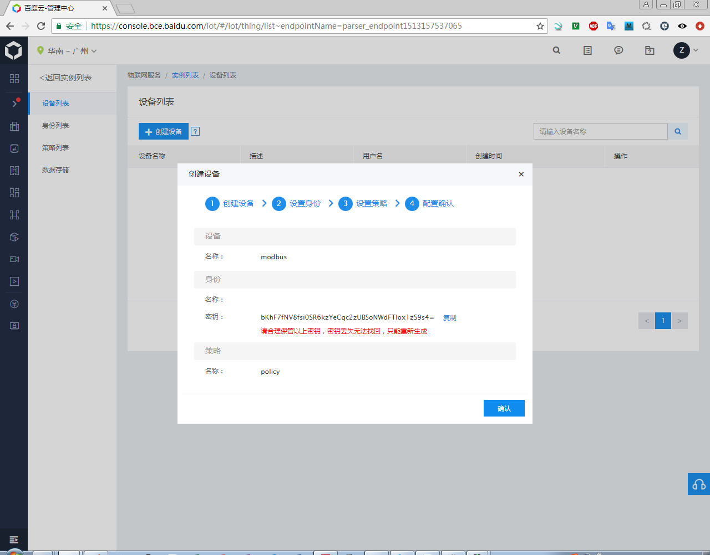
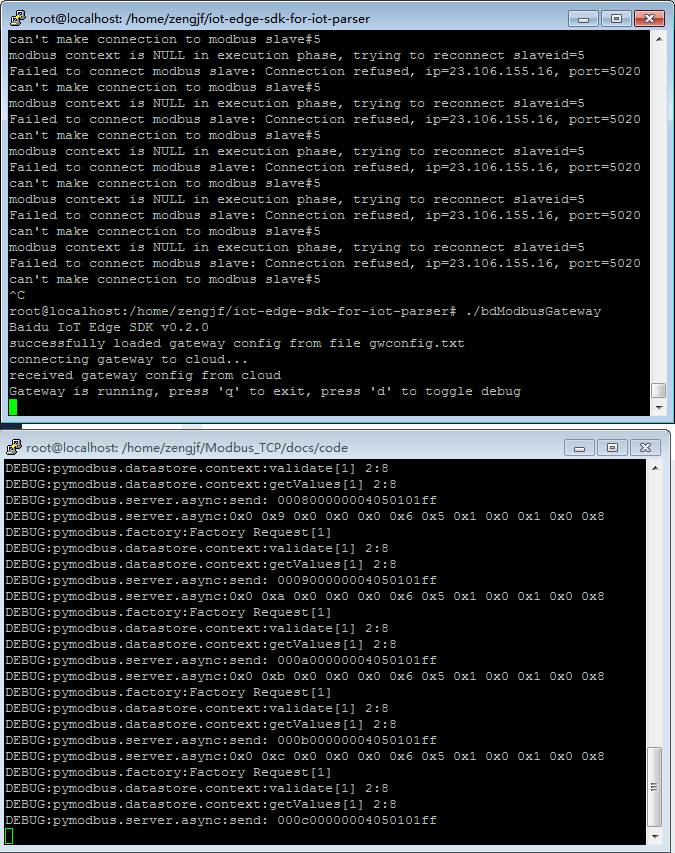

# Baidu iot-edge-sdk-for-iot-parser

## 参考文档

[管理网关设备](https://cloud.baidu.com/doc/Parser/GUIGettingStarted.html#.E6.96.B0.E5.BB.BA.E7.BD.91.E5.85.B3)

## Install iot-edge-sdk-for-iot-parser Output Message

```
root@localhost:/home/zengjf/iot-edge-sdk-for-iot-parser/modbus/nossl# ./install-ubuntu.sh
/home/zengjf/iot-edge-sdk-for-iot-parser/modbus/nossl
gcc version:20160609
sudo: add-apt-repository: command not found
Get:1 http://security.ubuntu.com/ubuntu xenial-security InRelease [102 kB]
Hit:2 http://archive.canonical.com/ubuntu xenial InRelease
Hit:3 http://archive.ubuntu.com/ubuntu xenial InRelease
Get:4 http://archive.ubuntu.com/ubuntu xenial-updates InRelease [102 kB]
Get:5 http://security.ubuntu.com/ubuntu xenial-security/universe amd64 Packages [190 kB]
Get:6 http://archive.ubuntu.com/ubuntu xenial-updates/main amd64 Packages [681 kB]
Get:7 http://archive.ubuntu.com/ubuntu xenial-updates/main Translation-en [284 kB]
Get:8 http://archive.ubuntu.com/ubuntu xenial-updates/universe amd64 Packages [565 kB]
Fetched 1925 kB in 2s (860 kB/s)
Reading package lists... Done
Reading package lists... Done
Building dependency tree
Reading state information... Done
The following additional packages will be installed:
  cpp-4.9 libasan1 libgcc-4.9-dev
Suggested packages:
  gcc-4.9-locales gcc-4.9-multilib gcc-4.9-doc libgcc1-dbg libgomp1-dbg
  libitm1-dbg libatomic1-dbg libasan1-dbg liblsan0-dbg libtsan0-dbg
  libubsan0-dbg libcilkrts5-dbg libquadmath0-dbg
The following NEW packages will be installed:
  cpp-4.9 gcc-4.9 libasan1 libgcc-4.9-dev
0 upgraded, 4 newly installed, 0 to remove and 196 not upgraded.
Need to get 12.7 MB of archives.
After this operation, 44.6 MB of additional disk space will be used.
Get:1 http://archive.ubuntu.com/ubuntu xenial/universe amd64 cpp-4.9 amd64 4.9.3-13ubuntu2 [4972 kB]
Get:2 http://archive.ubuntu.com/ubuntu xenial/universe amd64 libasan1 amd64 4.9.3-13ubuntu2 [197 kB]
Get:3 http://archive.ubuntu.com/ubuntu xenial/universe amd64 libgcc-4.9-dev amd64 4.9.3-13ubuntu2 [2073 kB]
Get:4 http://archive.ubuntu.com/ubuntu xenial/universe amd64 gcc-4.9 amd64 4.9.3-13ubuntu2 [5442 kB]
Fetched 12.7 MB in 2s (4350 kB/s)
Selecting previously unselected package cpp-4.9.
(Reading database ... 53456 files and directories currently installed.)
Preparing to unpack .../cpp-4.9_4.9.3-13ubuntu2_amd64.deb ...
Unpacking cpp-4.9 (4.9.3-13ubuntu2) ...
Selecting previously unselected package libasan1:amd64.
Preparing to unpack .../libasan1_4.9.3-13ubuntu2_amd64.deb ...
Unpacking libasan1:amd64 (4.9.3-13ubuntu2) ...
Selecting previously unselected package libgcc-4.9-dev:amd64.
Preparing to unpack .../libgcc-4.9-dev_4.9.3-13ubuntu2_amd64.deb ...
Unpacking libgcc-4.9-dev:amd64 (4.9.3-13ubuntu2) ...
Selecting previously unselected package gcc-4.9.
Preparing to unpack .../gcc-4.9_4.9.3-13ubuntu2_amd64.deb ...
Unpacking gcc-4.9 (4.9.3-13ubuntu2) ...
Processing triggers for man-db (2.7.5-1) ...
Processing triggers for libc-bin (2.23-0ubuntu3) ...
Setting up cpp-4.9 (4.9.3-13ubuntu2) ...
Setting up libasan1:amd64 (4.9.3-13ubuntu2) ...
Setting up libgcc-4.9-dev:amd64 (4.9.3-13ubuntu2) ...
Setting up gcc-4.9 (4.9.3-13ubuntu2) ...
Processing triggers for libc-bin (2.23-0ubuntu3) ...
W: --force-yes is deprecated, use one of the options starting with --allow instead.
1, install git
Reading package lists... Done
Building dependency tree
Reading state information... Done
Suggested packages:
  git-daemon-run | git-daemon-sysvinit git-doc git-el git-email git-gui gitk
  gitweb git-arch git-cvs git-mediawiki git-svn
The following packages will be upgraded:
  git
1 upgraded, 0 newly installed, 0 to remove and 195 not upgraded.
Need to get 3102 kB of archives.
After this operation, 0 B of additional disk space will be used.
Get:1 http://archive.ubuntu.com/ubuntu xenial-updates/main amd64 git amd64 1:2.7.4-0ubuntu1.3 [3102 kB]
Fetched 3102 kB in 1s (1745 kB/s)
(Reading database ... 53643 files and directories currently installed.)
Preparing to unpack .../git_1%3a2.7.4-0ubuntu1.3_amd64.deb ...
Unpacking git (1:2.7.4-0ubuntu1.3) over (1:2.7.4-0ubuntu1.2) ...
Setting up git (1:2.7.4-0ubuntu1.3) ...
W: --force-yes is deprecated, use one of the options starting with --allow instead.
2, install auto conf
Reading package lists... Done
Building dependency tree
Reading state information... Done
autoconf is already the newest version (2.69-9).
0 upgraded, 0 newly installed, 0 to remove and 195 not upgraded.
3, install libtool
Reading package lists... Done
Building dependency tree
Reading state information... Done
libtool is already the newest version (2.4.6-0.1).
0 upgraded, 0 newly installed, 0 to remove and 195 not upgraded.
4, make a temp dir
5, download and install cJSON
--2017-12-20 20:12:10--  https://github.com/DaveGamble/cJSON/archive/v1.5.9.tar.gz
Resolving github.com (github.com)... 192.30.255.113, 192.30.255.112
Connecting to github.com (github.com)|192.30.255.113|:443... connected.
HTTP request sent, awaiting response... 302 Found
Location: https://codeload.github.com/DaveGamble/cJSON/tar.gz/v1.5.9 [following]
--2017-12-20 20:12:10--  https://codeload.github.com/DaveGamble/cJSON/tar.gz/v1.5.9
Resolving codeload.github.com (codeload.github.com)... 192.30.255.121, 192.30.255.120
Connecting to codeload.github.com (codeload.github.com)|192.30.255.121|:443... connected.
HTTP request sent, awaiting response... 200 OK
Length: unspecified [application/x-gzip]
Saving to: 'v1.5.9.tar.gz'

v1.5.9.tar.gz           [ <=>                ] 325.51K  --.-KB/s    in 0.1s

2017-12-20 20:12:11 (2.13 MB/s) - 'v1.5.9.tar.gz' saved [333322]

cJSON-1.5.9/
cJSON-1.5.9/.github/
cJSON-1.5.9/.github/CONTRIBUTING.md
cJSON-1.5.9/.gitignore
cJSON-1.5.9/.travis.yml
cJSON-1.5.9/CHANGELOG.md
cJSON-1.5.9/CMakeLists.txt
cJSON-1.5.9/CONTRIBUTORS.md
cJSON-1.5.9/LICENSE
cJSON-1.5.9/Makefile
cJSON-1.5.9/README.md
cJSON-1.5.9/cJSON.c
cJSON-1.5.9/cJSON.h
cJSON-1.5.9/cJSON_Utils.c
cJSON-1.5.9/cJSON_Utils.h
cJSON-1.5.9/fuzzing/
cJSON-1.5.9/fuzzing/.gitignore
cJSON-1.5.9/fuzzing/CMakeLists.txt
cJSON-1.5.9/fuzzing/afl-prepare-linux.sh
cJSON-1.5.9/fuzzing/afl.c
cJSON-1.5.9/fuzzing/afl.sh
cJSON-1.5.9/fuzzing/inputs/
cJSON-1.5.9/fuzzing/inputs/test1
cJSON-1.5.9/fuzzing/inputs/test10
cJSON-1.5.9/fuzzing/inputs/test11
cJSON-1.5.9/fuzzing/inputs/test2
cJSON-1.5.9/fuzzing/inputs/test3
cJSON-1.5.9/fuzzing/inputs/test3.bu
cJSON-1.5.9/fuzzing/inputs/test3.uf
cJSON-1.5.9/fuzzing/inputs/test3.uu
cJSON-1.5.9/fuzzing/inputs/test4
cJSON-1.5.9/fuzzing/inputs/test5
cJSON-1.5.9/fuzzing/inputs/test6
cJSON-1.5.9/fuzzing/inputs/test7
cJSON-1.5.9/fuzzing/inputs/test8
cJSON-1.5.9/fuzzing/inputs/test9
cJSON-1.5.9/fuzzing/json.dict
cJSON-1.5.9/library_config/
cJSON-1.5.9/library_config/cJSONConfig.cmake.in
cJSON-1.5.9/library_config/cJSONConfigVersion.cmake.in
cJSON-1.5.9/library_config/libcjson.pc.in
cJSON-1.5.9/library_config/libcjson_utils.pc.in
cJSON-1.5.9/test.c
cJSON-1.5.9/tests/
cJSON-1.5.9/tests/CMakeLists.txt
cJSON-1.5.9/tests/common.c
cJSON-1.5.9/tests/common.h
cJSON-1.5.9/tests/compare_tests.c
cJSON-1.5.9/tests/inputs/
cJSON-1.5.9/tests/inputs/test1
cJSON-1.5.9/tests/inputs/test1.expected
cJSON-1.5.9/tests/inputs/test10
cJSON-1.5.9/tests/inputs/test10.expected
cJSON-1.5.9/tests/inputs/test11
cJSON-1.5.9/tests/inputs/test11.expected
cJSON-1.5.9/tests/inputs/test2
cJSON-1.5.9/tests/inputs/test2.expected
cJSON-1.5.9/tests/inputs/test3
cJSON-1.5.9/tests/inputs/test3.expected
cJSON-1.5.9/tests/inputs/test4
cJSON-1.5.9/tests/inputs/test4.expected
cJSON-1.5.9/tests/inputs/test5
cJSON-1.5.9/tests/inputs/test5.expected
cJSON-1.5.9/tests/inputs/test6
cJSON-1.5.9/tests/inputs/test7
cJSON-1.5.9/tests/inputs/test7.expected
cJSON-1.5.9/tests/inputs/test8
cJSON-1.5.9/tests/inputs/test8.expected
cJSON-1.5.9/tests/inputs/test9
cJSON-1.5.9/tests/inputs/test9.expected
cJSON-1.5.9/tests/json-patch-tests/
cJSON-1.5.9/tests/json-patch-tests/.editorconfig
cJSON-1.5.9/tests/json-patch-tests/.gitignore
cJSON-1.5.9/tests/json-patch-tests/.npmignore
cJSON-1.5.9/tests/json-patch-tests/README.md
cJSON-1.5.9/tests/json-patch-tests/cjson-utils-tests.json
cJSON-1.5.9/tests/json-patch-tests/package.json
cJSON-1.5.9/tests/json-patch-tests/spec_tests.json
cJSON-1.5.9/tests/json-patch-tests/tests.json
cJSON-1.5.9/tests/json_patch_tests.c
cJSON-1.5.9/tests/misc_tests.c
cJSON-1.5.9/tests/misc_utils_tests.c
cJSON-1.5.9/tests/old_utils_tests.c
cJSON-1.5.9/tests/parse_array.c
cJSON-1.5.9/tests/parse_examples.c
cJSON-1.5.9/tests/parse_hex4.c
cJSON-1.5.9/tests/parse_number.c
cJSON-1.5.9/tests/parse_object.c
cJSON-1.5.9/tests/parse_string.c
cJSON-1.5.9/tests/parse_value.c
cJSON-1.5.9/tests/parse_with_opts.c
cJSON-1.5.9/tests/print_array.c
cJSON-1.5.9/tests/print_number.c
cJSON-1.5.9/tests/print_object.c
cJSON-1.5.9/tests/print_string.c
cJSON-1.5.9/tests/print_value.c
cJSON-1.5.9/tests/unity/
cJSON-1.5.9/tests/unity/.gitattributes
cJSON-1.5.9/tests/unity/.gitignore
cJSON-1.5.9/tests/unity/.travis.yml
cJSON-1.5.9/tests/unity/README.md
cJSON-1.5.9/tests/unity/auto/
cJSON-1.5.9/tests/unity/auto/colour_prompt.rb
cJSON-1.5.9/tests/unity/auto/colour_reporter.rb
cJSON-1.5.9/tests/unity/auto/generate_config.yml
cJSON-1.5.9/tests/unity/auto/generate_module.rb
cJSON-1.5.9/tests/unity/auto/generate_test_runner.rb
cJSON-1.5.9/tests/unity/auto/parse_output.rb
cJSON-1.5.9/tests/unity/auto/stylize_as_junit.rb
cJSON-1.5.9/tests/unity/auto/test_file_filter.rb
cJSON-1.5.9/tests/unity/auto/type_sanitizer.rb
cJSON-1.5.9/tests/unity/auto/unity_test_summary.py
cJSON-1.5.9/tests/unity/auto/unity_test_summary.rb
cJSON-1.5.9/tests/unity/auto/unity_to_junit.py
cJSON-1.5.9/tests/unity/docs/
cJSON-1.5.9/tests/unity/docs/ThrowTheSwitchCodingStandard.md
cJSON-1.5.9/tests/unity/docs/UnityAssertionsCheatSheetSuitableforPrintingandPossiblyFraming.pdf
cJSON-1.5.9/tests/unity/docs/UnityAssertionsReference.md
cJSON-1.5.9/tests/unity/docs/UnityConfigurationGuide.md
cJSON-1.5.9/tests/unity/docs/UnityGettingStartedGuide.md
cJSON-1.5.9/tests/unity/docs/UnityHelperScriptsGuide.md
cJSON-1.5.9/tests/unity/docs/license.txt
cJSON-1.5.9/tests/unity/examples/
cJSON-1.5.9/tests/unity/examples/example_1/
cJSON-1.5.9/tests/unity/examples/example_1/makefile
cJSON-1.5.9/tests/unity/examples/example_1/readme.txt
cJSON-1.5.9/tests/unity/examples/example_1/src/
cJSON-1.5.9/tests/unity/examples/example_1/src/ProductionCode.c
cJSON-1.5.9/tests/unity/examples/example_1/src/ProductionCode.h
cJSON-1.5.9/tests/unity/examples/example_1/src/ProductionCode2.c
cJSON-1.5.9/tests/unity/examples/example_1/src/ProductionCode2.h
cJSON-1.5.9/tests/unity/examples/example_1/test/
cJSON-1.5.9/tests/unity/examples/example_1/test/TestProductionCode.c
cJSON-1.5.9/tests/unity/examples/example_1/test/TestProductionCode2.c
cJSON-1.5.9/tests/unity/examples/example_1/test/test_runners/
cJSON-1.5.9/tests/unity/examples/example_1/test/test_runners/TestProductionCode2_Runner.c
cJSON-1.5.9/tests/unity/examples/example_1/test/test_runners/TestProductionCode_Runner.c
cJSON-1.5.9/tests/unity/examples/example_2/
cJSON-1.5.9/tests/unity/examples/example_2/makefile
cJSON-1.5.9/tests/unity/examples/example_2/readme.txt
cJSON-1.5.9/tests/unity/examples/example_2/src/
cJSON-1.5.9/tests/unity/examples/example_2/src/ProductionCode.c
cJSON-1.5.9/tests/unity/examples/example_2/src/ProductionCode.h
cJSON-1.5.9/tests/unity/examples/example_2/src/ProductionCode2.c
cJSON-1.5.9/tests/unity/examples/example_2/src/ProductionCode2.h
cJSON-1.5.9/tests/unity/examples/example_2/test/
cJSON-1.5.9/tests/unity/examples/example_2/test/TestProductionCode.c
cJSON-1.5.9/tests/unity/examples/example_2/test/TestProductionCode2.c
cJSON-1.5.9/tests/unity/examples/example_2/test/test_runners/
cJSON-1.5.9/tests/unity/examples/example_2/test/test_runners/TestProductionCode2_Runner.c
cJSON-1.5.9/tests/unity/examples/example_2/test/test_runners/TestProductionCode_Runner.c
cJSON-1.5.9/tests/unity/examples/example_2/test/test_runners/all_tests.c
cJSON-1.5.9/tests/unity/examples/example_3/
cJSON-1.5.9/tests/unity/examples/example_3/helper/
cJSON-1.5.9/tests/unity/examples/example_3/helper/UnityHelper.c
cJSON-1.5.9/tests/unity/examples/example_3/helper/UnityHelper.h
cJSON-1.5.9/tests/unity/examples/example_3/rakefile.rb
cJSON-1.5.9/tests/unity/examples/example_3/rakefile_helper.rb
cJSON-1.5.9/tests/unity/examples/example_3/readme.txt
cJSON-1.5.9/tests/unity/examples/example_3/src/
cJSON-1.5.9/tests/unity/examples/example_3/src/ProductionCode.c
cJSON-1.5.9/tests/unity/examples/example_3/src/ProductionCode.h
cJSON-1.5.9/tests/unity/examples/example_3/src/ProductionCode2.c
cJSON-1.5.9/tests/unity/examples/example_3/src/ProductionCode2.h
cJSON-1.5.9/tests/unity/examples/example_3/target_gcc_32.yml
cJSON-1.5.9/tests/unity/examples/example_3/test/
cJSON-1.5.9/tests/unity/examples/example_3/test/TestProductionCode.c
cJSON-1.5.9/tests/unity/examples/example_3/test/TestProductionCode2.c
cJSON-1.5.9/tests/unity/examples/unity_config.h
cJSON-1.5.9/tests/unity/extras/
cJSON-1.5.9/tests/unity/extras/eclipse/
cJSON-1.5.9/tests/unity/extras/eclipse/error_parsers.txt
cJSON-1.5.9/tests/unity/extras/fixture/
cJSON-1.5.9/tests/unity/extras/fixture/rakefile.rb
cJSON-1.5.9/tests/unity/extras/fixture/rakefile_helper.rb
cJSON-1.5.9/tests/unity/extras/fixture/readme.txt
cJSON-1.5.9/tests/unity/extras/fixture/src/
cJSON-1.5.9/tests/unity/extras/fixture/src/unity_fixture.c
cJSON-1.5.9/tests/unity/extras/fixture/src/unity_fixture.h
cJSON-1.5.9/tests/unity/extras/fixture/src/unity_fixture_internals.h
cJSON-1.5.9/tests/unity/extras/fixture/src/unity_fixture_malloc_overrides.h
cJSON-1.5.9/tests/unity/extras/fixture/test/
cJSON-1.5.9/tests/unity/extras/fixture/test/Makefile
cJSON-1.5.9/tests/unity/extras/fixture/test/main/
cJSON-1.5.9/tests/unity/extras/fixture/test/main/AllTests.c
cJSON-1.5.9/tests/unity/extras/fixture/test/template_fixture_tests.c
cJSON-1.5.9/tests/unity/extras/fixture/test/unity_fixture_Test.c
cJSON-1.5.9/tests/unity/extras/fixture/test/unity_fixture_TestRunner.c
cJSON-1.5.9/tests/unity/extras/fixture/test/unity_output_Spy.c
cJSON-1.5.9/tests/unity/extras/fixture/test/unity_output_Spy.h
cJSON-1.5.9/tests/unity/release/
cJSON-1.5.9/tests/unity/release/build.info
cJSON-1.5.9/tests/unity/release/version.info
cJSON-1.5.9/tests/unity/src/
cJSON-1.5.9/tests/unity/src/unity.c
cJSON-1.5.9/tests/unity/src/unity.h
cJSON-1.5.9/tests/unity/src/unity_internals.h
cJSON-1.5.9/tests/unity/test/
cJSON-1.5.9/tests/unity/test/.rubocop.yml
cJSON-1.5.9/tests/unity/test/Makefile
cJSON-1.5.9/tests/unity/test/expectdata/
cJSON-1.5.9/tests/unity/test/expectdata/testsample_cmd.c
cJSON-1.5.9/tests/unity/test/expectdata/testsample_def.c
cJSON-1.5.9/tests/unity/test/expectdata/testsample_head1.c
cJSON-1.5.9/tests/unity/test/expectdata/testsample_head1.h
cJSON-1.5.9/tests/unity/test/expectdata/testsample_mock_cmd.c
cJSON-1.5.9/tests/unity/test/expectdata/testsample_mock_def.c
cJSON-1.5.9/tests/unity/test/expectdata/testsample_mock_head1.c
cJSON-1.5.9/tests/unity/test/expectdata/testsample_mock_head1.h
cJSON-1.5.9/tests/unity/test/expectdata/testsample_mock_new1.c
cJSON-1.5.9/tests/unity/test/expectdata/testsample_mock_new2.c
cJSON-1.5.9/tests/unity/test/expectdata/testsample_mock_param.c
cJSON-1.5.9/tests/unity/test/expectdata/testsample_mock_run1.c
cJSON-1.5.9/tests/unity/test/expectdata/testsample_mock_run2.c
cJSON-1.5.9/tests/unity/test/expectdata/testsample_mock_yaml.c
cJSON-1.5.9/tests/unity/test/expectdata/testsample_new1.c
cJSON-1.5.9/tests/unity/test/expectdata/testsample_new2.c
cJSON-1.5.9/tests/unity/test/expectdata/testsample_param.c
cJSON-1.5.9/tests/unity/test/expectdata/testsample_run1.c
cJSON-1.5.9/tests/unity/test/expectdata/testsample_run2.c
cJSON-1.5.9/tests/unity/test/expectdata/testsample_yaml.c
cJSON-1.5.9/tests/unity/test/rakefile
cJSON-1.5.9/tests/unity/test/rakefile_helper.rb
cJSON-1.5.9/tests/unity/test/spec/
cJSON-1.5.9/tests/unity/test/spec/generate_module_existing_file_spec.rb
cJSON-1.5.9/tests/unity/test/targets/
cJSON-1.5.9/tests/unity/test/targets/clang_file.yml
cJSON-1.5.9/tests/unity/test/targets/clang_strict.yml
cJSON-1.5.9/tests/unity/test/targets/gcc_32.yml
cJSON-1.5.9/tests/unity/test/targets/gcc_64.yml
cJSON-1.5.9/tests/unity/test/targets/gcc_auto_limits.yml
cJSON-1.5.9/tests/unity/test/targets/gcc_auto_stdint.yml
cJSON-1.5.9/tests/unity/test/targets/gcc_manual_math.yml
cJSON-1.5.9/tests/unity/test/targets/hitech_picc18.yml
cJSON-1.5.9/tests/unity/test/targets/iar_arm_v4.yml
cJSON-1.5.9/tests/unity/test/targets/iar_arm_v5.yml
cJSON-1.5.9/tests/unity/test/targets/iar_arm_v5_3.yml
cJSON-1.5.9/tests/unity/test/targets/iar_armcortex_LM3S9B92_v5_4.yml
cJSON-1.5.9/tests/unity/test/targets/iar_cortexm3_v5.yml
cJSON-1.5.9/tests/unity/test/targets/iar_msp430.yml
cJSON-1.5.9/tests/unity/test/targets/iar_sh2a_v6.yml
cJSON-1.5.9/tests/unity/test/testdata/
cJSON-1.5.9/tests/unity/test/testdata/CException.h
cJSON-1.5.9/tests/unity/test/testdata/Defs.h
cJSON-1.5.9/tests/unity/test/testdata/cmock.h
cJSON-1.5.9/tests/unity/test/testdata/mockMock.h
cJSON-1.5.9/tests/unity/test/testdata/testRunnerGenerator.c
cJSON-1.5.9/tests/unity/test/testdata/testRunnerGeneratorSmall.c
cJSON-1.5.9/tests/unity/test/testdata/testRunnerGeneratorWithMocks.c
cJSON-1.5.9/tests/unity/test/tests/
cJSON-1.5.9/tests/unity/test/tests/test_generate_test_runner.rb
cJSON-1.5.9/tests/unity/test/tests/testparameterized.c
cJSON-1.5.9/tests/unity/test/tests/testunity.c
cJSON-1.5.9/valgrind.supp
-- The C compiler identification is GNU 4.9.3
-- Check for working C compiler: /usr/bin/gcc
-- Check for working C compiler: /usr/bin/gcc -- works
-- Detecting C compiler ABI info
-- Detecting C compiler ABI info - done
-- Detecting C compile features
-- Detecting C compile features - done
-- Performing Test FLAG_SUPPORTED_stdc89
-- Performing Test FLAG_SUPPORTED_stdc89 - Success
-- Performing Test FLAG_SUPPORTED_pedantic
-- Performing Test FLAG_SUPPORTED_pedantic - Success
-- Performing Test FLAG_SUPPORTED_Wall
-- Performing Test FLAG_SUPPORTED_Wall - Success
-- Performing Test FLAG_SUPPORTED_Wextra
-- Performing Test FLAG_SUPPORTED_Wextra - Success
-- Performing Test FLAG_SUPPORTED_Werror
-- Performing Test FLAG_SUPPORTED_Werror - Success
-- Performing Test FLAG_SUPPORTED_Wstrictprototypes
-- Performing Test FLAG_SUPPORTED_Wstrictprototypes - Success
-- Performing Test FLAG_SUPPORTED_Wwritestrings
-- Performing Test FLAG_SUPPORTED_Wwritestrings - Success
-- Performing Test FLAG_SUPPORTED_Wshadow
-- Performing Test FLAG_SUPPORTED_Wshadow - Success
-- Performing Test FLAG_SUPPORTED_Winitself
-- Performing Test FLAG_SUPPORTED_Winitself - Success
-- Performing Test FLAG_SUPPORTED_Wcastalign
-- Performing Test FLAG_SUPPORTED_Wcastalign - Success
-- Performing Test FLAG_SUPPORTED_Wformat2
-- Performing Test FLAG_SUPPORTED_Wformat2 - Success
-- Performing Test FLAG_SUPPORTED_Wmissingprototypes
-- Performing Test FLAG_SUPPORTED_Wmissingprototypes - Success
-- Performing Test FLAG_SUPPORTED_Wstrictoverflow2
-- Performing Test FLAG_SUPPORTED_Wstrictoverflow2 - Success
-- Performing Test FLAG_SUPPORTED_Wcastqual
-- Performing Test FLAG_SUPPORTED_Wcastqual - Success
-- Performing Test FLAG_SUPPORTED_Wundef
-- Performing Test FLAG_SUPPORTED_Wundef - Success
-- Performing Test FLAG_SUPPORTED_Wswitchdefault
-- Performing Test FLAG_SUPPORTED_Wswitchdefault - Success
-- Performing Test FLAG_SUPPORTED_Wconversion
-- Performing Test FLAG_SUPPORTED_Wconversion - Success
-- Performing Test FLAG_SUPPORTED_Wccompat
-- Performing Test FLAG_SUPPORTED_Wccompat - Success
-- Performing Test FLAG_SUPPORTED_fstackprotectorstrong
-- Performing Test FLAG_SUPPORTED_fstackprotectorstrong - Success
-- Performing Test FLAG_SUPPORTED_Wcomma
-- Performing Test FLAG_SUPPORTED_Wcomma - Failed
-- Performing Test FLAG_SUPPORTED_Wdoublepromotion
-- Performing Test FLAG_SUPPORTED_Wdoublepromotion - Success
-- Performing Test FLAG_SUPPORTED_Wparentheses
-- Performing Test FLAG_SUPPORTED_Wparentheses - Success
-- Performing Test FLAG_SUPPORTED_Wformatoverflow
-- Performing Test FLAG_SUPPORTED_Wformatoverflow - Failed
-- Performing Test FLAG_SUPPORTED_fvisibilityhidden
-- Performing Test FLAG_SUPPORTED_fvisibilityhidden - Success
-- Configuring done
-- Generating done
-- Build files have been written to: /home/zengjf/iot-edge-sdk-for-iot-parser/modbus/nossl/deps_linux_x86/cmake
Scanning dependencies of target cjson
[ 50%] Building C object CMakeFiles/cjson.dir/cJSON.c.o
[100%] Linking C static library libcjson.a
[100%] Built target cjson
[100%] Built target cjson
Install the project...
-- Install configuration: ""
-- Installing: /home/zengjf/iot-edge-sdk-for-iot-parser/modbus/nossl/deps_linux_x86/output/include/cjson/cJSON.h
-- Installing: /home/zengjf/iot-edge-sdk-for-iot-parser/modbus/nossl/deps_linux_x86/output/lib/pkgconfig/libcjson.pc
-- Installing: /home/zengjf/iot-edge-sdk-for-iot-parser/modbus/nossl/deps_linux_x86/output/lib/libcjson.a
-- Installing: /home/zengjf/iot-edge-sdk-for-iot-parser/modbus/nossl/deps_linux_x86/output/lib/cmake/cJSON/cjson.cmake
-- Installing: /home/zengjf/iot-edge-sdk-for-iot-parser/modbus/nossl/deps_linux_x86/output/lib/cmake/cJSON/cjson-noconfig.cmake
-- Installing: /home/zengjf/iot-edge-sdk-for-iot-parser/modbus/nossl/deps_linux_x86/output/lib/cmake/cJSON/cJSONConfig.cmake
-- Installing: /home/zengjf/iot-edge-sdk-for-iot-parser/modbus/nossl/deps_linux_x86/output/lib/cmake/cJSON/cJSONConfigVersion.cmake
6, download and install libmodbus
--2017-12-20 20:12:13--  https://github.com/stephane/libmodbus/archive/v3.1.4.tar.gz
Resolving github.com (github.com)... 192.30.255.113, 192.30.255.112
Connecting to github.com (github.com)|192.30.255.113|:443... connected.
HTTP request sent, awaiting response... 302 Found
Location: https://codeload.github.com/stephane/libmodbus/tar.gz/v3.1.4 [following]
--2017-12-20 20:12:13--  https://codeload.github.com/stephane/libmodbus/tar.gz/v3.1.4
Resolving codeload.github.com (codeload.github.com)... 192.30.255.121, 192.30.255.120
Connecting to codeload.github.com (codeload.github.com)|192.30.255.121|:443... connected.
HTTP request sent, awaiting response... 200 OK
Length: unspecified [application/x-gzip]
Saving to: 'v3.1.4.tar.gz'

v3.1.4.tar.gz           [ <=>                ]  90.43K  --.-KB/s    in 0.06s

2017-12-20 20:12:14 (1.41 MB/s) - 'v3.1.4.tar.gz' saved [92596]

libmodbus-3.1.4/
libmodbus-3.1.4/.dir-locals.el
libmodbus-3.1.4/.gitignore
libmodbus-3.1.4/.travis.yml
libmodbus-3.1.4/AUTHORS
libmodbus-3.1.4/CONTRIBUTING.md
libmodbus-3.1.4/COPYING.LESSER
libmodbus-3.1.4/ISSUE_TEMPLATE.md
libmodbus-3.1.4/MIGRATION
libmodbus-3.1.4/Makefile.am
libmodbus-3.1.4/NEWS
libmodbus-3.1.4/README.md
libmodbus-3.1.4/acinclude.m4
libmodbus-3.1.4/autogen.sh
libmodbus-3.1.4/configure.ac
libmodbus-3.1.4/doc/
libmodbus-3.1.4/doc/Makefile.am
libmodbus-3.1.4/doc/asciidoc.conf
libmodbus-3.1.4/doc/libmodbus.txt
libmodbus-3.1.4/doc/modbus_close.txt
libmodbus-3.1.4/doc/modbus_connect.txt
libmodbus-3.1.4/doc/modbus_flush.txt
libmodbus-3.1.4/doc/modbus_free.txt
libmodbus-3.1.4/doc/modbus_get_byte_from_bits.txt
libmodbus-3.1.4/doc/modbus_get_byte_timeout.txt
libmodbus-3.1.4/doc/modbus_get_float.txt
libmodbus-3.1.4/doc/modbus_get_float_abcd.txt
libmodbus-3.1.4/doc/modbus_get_float_badc.txt
libmodbus-3.1.4/doc/modbus_get_float_cdab.txt
libmodbus-3.1.4/doc/modbus_get_float_dcba.txt
libmodbus-3.1.4/doc/modbus_get_header_length.txt
libmodbus-3.1.4/doc/modbus_get_response_timeout.txt
libmodbus-3.1.4/doc/modbus_get_socket.txt
libmodbus-3.1.4/doc/modbus_mapping_free.txt
libmodbus-3.1.4/doc/modbus_mapping_new.txt
libmodbus-3.1.4/doc/modbus_mapping_new_start_address.txt
libmodbus-3.1.4/doc/modbus_mask_write_register.txt
libmodbus-3.1.4/doc/modbus_new_rtu.txt
libmodbus-3.1.4/doc/modbus_new_tcp.txt
libmodbus-3.1.4/doc/modbus_new_tcp_pi.txt
libmodbus-3.1.4/doc/modbus_read_bits.txt
libmodbus-3.1.4/doc/modbus_read_input_bits.txt
libmodbus-3.1.4/doc/modbus_read_input_registers.txt
libmodbus-3.1.4/doc/modbus_read_registers.txt
libmodbus-3.1.4/doc/modbus_receive.txt
libmodbus-3.1.4/doc/modbus_receive_confirmation.txt
libmodbus-3.1.4/doc/modbus_reply.txt
libmodbus-3.1.4/doc/modbus_reply_exception.txt
libmodbus-3.1.4/doc/modbus_report_slave_id.txt
libmodbus-3.1.4/doc/modbus_rtu_get_rts.txt
libmodbus-3.1.4/doc/modbus_rtu_get_rts_delay.txt
libmodbus-3.1.4/doc/modbus_rtu_get_serial_mode.txt
libmodbus-3.1.4/doc/modbus_rtu_set_custom_rts.txt
libmodbus-3.1.4/doc/modbus_rtu_set_rts.txt
libmodbus-3.1.4/doc/modbus_rtu_set_rts_delay.txt
libmodbus-3.1.4/doc/modbus_rtu_set_serial_mode.txt
libmodbus-3.1.4/doc/modbus_send_raw_request.txt
libmodbus-3.1.4/doc/modbus_set_bits_from_byte.txt
libmodbus-3.1.4/doc/modbus_set_bits_from_bytes.txt
libmodbus-3.1.4/doc/modbus_set_byte_timeout.txt
libmodbus-3.1.4/doc/modbus_set_debug.txt
libmodbus-3.1.4/doc/modbus_set_error_recovery.txt
libmodbus-3.1.4/doc/modbus_set_float.txt
libmodbus-3.1.4/doc/modbus_set_float_abcd.txt
libmodbus-3.1.4/doc/modbus_set_float_badc.txt
libmodbus-3.1.4/doc/modbus_set_float_cdab.txt
libmodbus-3.1.4/doc/modbus_set_float_dcba.txt
libmodbus-3.1.4/doc/modbus_set_response_timeout.txt
libmodbus-3.1.4/doc/modbus_set_slave.txt
libmodbus-3.1.4/doc/modbus_set_socket.txt
libmodbus-3.1.4/doc/modbus_strerror.txt
libmodbus-3.1.4/doc/modbus_tcp_accept.txt
libmodbus-3.1.4/doc/modbus_tcp_listen.txt
libmodbus-3.1.4/doc/modbus_tcp_pi_accept.txt
libmodbus-3.1.4/doc/modbus_tcp_pi_listen.txt
libmodbus-3.1.4/doc/modbus_write_and_read_registers.txt
libmodbus-3.1.4/doc/modbus_write_bit.txt
libmodbus-3.1.4/doc/modbus_write_bits.txt
libmodbus-3.1.4/doc/modbus_write_register.txt
libmodbus-3.1.4/doc/modbus_write_registers.txt
libmodbus-3.1.4/libmodbus.pc.in
libmodbus-3.1.4/m4/
libmodbus-3.1.4/m4/.gitignore
libmodbus-3.1.4/src/
libmodbus-3.1.4/src/Makefile.am
libmodbus-3.1.4/src/modbus-data.c
libmodbus-3.1.4/src/modbus-private.h
libmodbus-3.1.4/src/modbus-rtu-private.h
libmodbus-3.1.4/src/modbus-rtu.c
libmodbus-3.1.4/src/modbus-rtu.h
libmodbus-3.1.4/src/modbus-tcp-private.h
libmodbus-3.1.4/src/modbus-tcp.c
libmodbus-3.1.4/src/modbus-tcp.h
libmodbus-3.1.4/src/modbus-version.h.in
libmodbus-3.1.4/src/modbus.c
libmodbus-3.1.4/src/modbus.h
libmodbus-3.1.4/src/win32/
libmodbus-3.1.4/src/win32/Make-tests
libmodbus-3.1.4/src/win32/README.win32
libmodbus-3.1.4/src/win32/config.h.win32
libmodbus-3.1.4/src/win32/configure.js
libmodbus-3.1.4/src/win32/modbus-9.sln
libmodbus-3.1.4/src/win32/modbus.dll.manifest.in
libmodbus-3.1.4/src/win32/modbus.rc
libmodbus-3.1.4/src/win32/modbus.vcproj
libmodbus-3.1.4/tests/
libmodbus-3.1.4/tests/LICENSE
libmodbus-3.1.4/tests/Makefile.am
libmodbus-3.1.4/tests/README.md
libmodbus-3.1.4/tests/bandwidth-client.c
libmodbus-3.1.4/tests/bandwidth-server-many-up.c
libmodbus-3.1.4/tests/bandwidth-server-one.c
libmodbus-3.1.4/tests/random-test-client.c
libmodbus-3.1.4/tests/random-test-server.c
libmodbus-3.1.4/tests/unit-test-client.c
libmodbus-3.1.4/tests/unit-test-server.c
libmodbus-3.1.4/tests/unit-test.h.in
libmodbus-3.1.4/tests/unit-tests.sh
libmodbus-3.1.4/tests/version.c
libtoolize: putting auxiliary files in AC_CONFIG_AUX_DIR, 'build-aux'.
libtoolize: linking file 'build-aux/ltmain.sh'
libtoolize: putting macros in AC_CONFIG_MACRO_DIRS, 'm4'.
libtoolize: linking file 'm4/libtool.m4'
libtoolize: linking file 'm4/ltoptions.m4'
libtoolize: linking file 'm4/ltsugar.m4'
libtoolize: linking file 'm4/ltversion.m4'
libtoolize: linking file 'm4/lt~obsolete.m4'
configure.ac:33: installing 'build-aux/compile'
configure.ac:56: installing 'build-aux/config.guess'
configure.ac:56: installing 'build-aux/config.sub'
configure.ac:32: installing 'build-aux/install-sh'
configure.ac:32: installing 'build-aux/missing'
src/Makefile.am: installing 'build-aux/depcomp'
parallel-tests: installing 'build-aux/test-driver'

------------------------------------------------------
Initialized build system. You can now run ./configure
------------------------------------------------------

checking for a BSD-compatible install... /usr/bin/install -c
checking whether build environment is sane... yes
checking for a thread-safe mkdir -p... /bin/mkdir -p
checking for gawk... gawk
checking whether make sets $(MAKE)... yes
checking whether make supports nested variables... yes
checking how to create a pax tar archive... gnutar
checking for style of include used by make... GNU
checking for gcc... gcc
checking whether the C compiler works... yes
checking for C compiler default output file name... a.out
checking for suffix of executables...
checking whether we are cross compiling... no
checking for suffix of object files... o
checking whether we are using the GNU C compiler... yes
checking whether gcc accepts -g... yes
checking for gcc option to accept ISO C89... none needed
checking whether gcc understands -c and -o together... yes
checking dependency style of gcc... gcc3
checking for gcc option to accept ISO C99... -std=gnu99
checking for gcc -std=gnu99 option to accept ISO Standard C... (cached) -std=gnu99
checking how to run the C preprocessor... gcc -std=gnu99 -E
checking for grep that handles long lines and -e... /bin/grep
checking for egrep... /bin/grep -E
checking for ANSI C header files... yes
checking for sys/types.h... yes
checking for sys/stat.h... yes
checking for stdlib.h... yes
checking for string.h... yes
checking for memory.h... yes
checking for strings.h... yes
checking for inttypes.h... yes
checking for stdint.h... yes
checking for unistd.h... yes
checking minix/config.h usability... no
checking minix/config.h presence... no
checking for minix/config.h... no
checking whether it is safe to define __EXTENSIONS__... yes
checking for special C compiler options needed for large files... no
checking for _FILE_OFFSET_BITS value needed for large files... no
checking whether make supports nested variables... (cached) yes
checking build system type... x86_64-pc-linux-gnu
checking host system type... x86_64-pc-linux-gnu
checking how to print strings... printf
checking for a sed that does not truncate output... /bin/sed
checking for fgrep... /bin/grep -F
checking for ld used by gcc -std=gnu99... /usr/bin/ld
checking if the linker (/usr/bin/ld) is GNU ld... yes
checking for BSD- or MS-compatible name lister (nm)... /usr/bin/nm -B
checking the name lister (/usr/bin/nm -B) interface... BSD nm
checking whether ln -s works... yes
checking the maximum length of command line arguments... 1966080
checking how to convert x86_64-pc-linux-gnu file names to x86_64-pc-linux-gnu format... func_convert_file_noop
checking how to convert x86_64-pc-linux-gnu file names to toolchain format... func_convert_file_noop
checking for /usr/bin/ld option to reload object files... -r
checking for objdump... objdump
checking how to recognize dependent libraries... pass_all
checking for dlltool... no
checking how to associate runtime and link libraries... printf %s\n
checking for ar... ar
checking for archiver @FILE support... @
checking for strip... strip
checking for ranlib... ranlib
checking command to parse /usr/bin/nm -B output from gcc -std=gnu99 object... ok
checking for sysroot... no
checking for a working dd... /bin/dd
checking how to truncate binary pipes... /bin/dd bs=4096 count=1
checking for mt... mt
checking if mt is a manifest tool... no
checking for dlfcn.h... yes
checking for objdir... .libs
checking if gcc -std=gnu99 supports -fno-rtti -fno-exceptions... no
checking for gcc -std=gnu99 option to produce PIC... -fPIC -DPIC
checking if gcc -std=gnu99 PIC flag -fPIC -DPIC works... yes
checking if gcc -std=gnu99 static flag -static works... yes
checking if gcc -std=gnu99 supports -c -o file.o... yes
checking if gcc -std=gnu99 supports -c -o file.o... (cached) yes
checking whether the gcc -std=gnu99 linker (/usr/bin/ld -m elf_x86_64) supports shared libraries... yes
checking whether -lc should be explicitly linked in... no
checking dynamic linker characteristics... GNU/Linux ld.so
checking how to hardcode library paths into programs... immediate
checking whether stripping libraries is possible... yes
checking if libtool supports shared libraries... yes
checking whether to build shared libraries... yes
checking whether to build static libraries... yes
checking arpa/inet.h usability... yes
checking arpa/inet.h presence... yes
checking for arpa/inet.h... yes
checking byteswap.h usability... yes
checking byteswap.h presence... yes
checking for byteswap.h... yes
checking errno.h usability... yes
checking errno.h presence... yes
checking for errno.h... yes
checking fcntl.h usability... yes
checking fcntl.h presence... yes
checking for fcntl.h... yes
checking limits.h usability... yes
checking limits.h presence... yes
checking for limits.h... yes
checking linux/serial.h usability... yes
checking linux/serial.h presence... yes
checking for linux/serial.h... yes
checking netdb.h usability... yes
checking netdb.h presence... yes
checking for netdb.h... yes
checking netinet/in.h usability... yes
checking netinet/in.h presence... yes
checking for netinet/in.h... yes
checking netinet/tcp.h usability... yes
checking netinet/tcp.h presence... yes
checking for netinet/tcp.h... yes
checking sys/ioctl.h usability... yes
checking sys/ioctl.h presence... yes
checking for sys/ioctl.h... yes
checking sys/params.h usability... no
checking sys/params.h presence... no
checking for sys/params.h... no
checking sys/socket.h usability... yes
checking sys/socket.h presence... yes
checking for sys/socket.h... yes
checking sys/time.h usability... yes
checking sys/time.h presence... yes
checking for sys/time.h... yes
checking for sys/types.h... (cached) yes
checking termios.h usability... yes
checking termios.h presence... yes
checking for termios.h... yes
checking time.h usability... yes
checking time.h presence... yes
checking for time.h... yes
checking for unistd.h... (cached) yes
checking for asciidoc... no
checking for xmlto... no
checking whether to build documentation... no
configure: WARNING: The tools to build the documentation aren't installed
checking whether __CYGWIN__ is declared... no
checking for pid_t... yes
checking vfork.h usability... no
checking vfork.h presence... no
checking for vfork.h... no
checking for fork... yes
checking for vfork... yes
checking for working fork... yes
checking for working vfork... (cached) yes
checking for stdlib.h... (cached) yes
checking for GNU libc compatible malloc... yes
checking for accept4... yes
checking for getaddrinfo... yes
checking for gettimeofday... yes
checking for inet_ntoa... yes
checking for memset... yes
checking for select... yes
checking for socket... yes
checking for strerror... yes
checking for strlcpy... no
checking for inline... inline
checking for g++... g++
checking whether we are using the GNU C++ compiler... yes
checking whether g++ accepts -g... yes
checking dependency style of g++... gcc3
checking how to run the C++ preprocessor... g++ -E
checking for ld used by g++... /usr/bin/ld -m elf_x86_64
checking if the linker (/usr/bin/ld -m elf_x86_64) is GNU ld... yes
checking whether the g++ linker (/usr/bin/ld -m elf_x86_64) supports shared libraries... yes
checking for g++ option to produce PIC... -fPIC -DPIC
checking if g++ PIC flag -fPIC -DPIC works... yes
checking if g++ static flag -static works... yes
checking if g++ supports -c -o file.o... yes
checking if g++ supports -c -o file.o... (cached) yes
checking whether the g++ linker (/usr/bin/ld -m elf_x86_64) supports shared libraries... yes
checking dynamic linker characteristics... (cached) GNU/Linux ld.so
checking how to hardcode library paths into programs... immediate
checking for int64_t... yes
checking for size_t... yes
checking for ssize_t... yes
checking for uint16_t... yes
checking for uint32_t... yes
checking for uint8_t... yes
checking winsock2.h usability... no
checking winsock2.h presence... no
checking for winsock2.h... no
checking whether TIOCSRS485 is declared... yes
checking whether TIOCM_RTS is declared... yes
checking that generated files are newer than configure... done
configure: creating ./config.status
config.status: creating Makefile
config.status: creating src/Makefile
config.status: creating src/modbus-version.h
config.status: creating src/win32/modbus.dll.manifest
config.status: creating tests/Makefile
config.status: creating doc/Makefile
config.status: creating libmodbus.pc
config.status: creating config.h
config.status: creating tests/unit-test.h
config.status: executing depfiles commands
config.status: executing libtool commands

        libmodbus 3.1.4
        ===============

        prefix:                 /home/zengjf/iot-edge-sdk-for-iot-parser/modbus/nossl/deps_linux_x86/output
        sysconfdir:             ${prefix}/etc
        libdir:                 ${exec_prefix}/lib
        includedir:             ${prefix}/include

        compiler:               gcc -std=gnu99
        cflags:                 -g -O2
        ldflags:

        documentation:          no
        tests:                  yes

Making install in src
  CC       modbus.lo
  CC       modbus-data.lo
  CC       modbus-rtu.lo
  CC       modbus-tcp.lo
  CCLD     libmodbus.la
ar: `u' modifier ignored since `D' is the default (see `U')
 /bin/mkdir -p '/home/zengjf/iot-edge-sdk-for-iot-parser/modbus/nossl/deps_linux_x86/output/lib'
 /bin/bash ../libtool   --mode=install /usr/bin/install -c   libmodbus.la '/home/zengjf/iot-edge-sdk-for-iot-parser/modbus/nossl/deps_linux_x86/output/lib'
libtool: install: /usr/bin/install -c .libs/libmodbus.so.5.1.0 /home/zengjf/iot-edge-sdk-for-iot-parser/modbus/nossl/deps_linux_x86/output/lib/libmodbus.so.5.1.0
libtool: install: (cd /home/zengjf/iot-edge-sdk-for-iot-parser/modbus/nossl/deps_linux_x86/output/lib && { ln -s -f libmodbus.so.5.1.0 libmodbus.so.5 || { rm -f libmodbus.so.5 && ln -s libmodbus.so.5.1.0 libmodbus.so.5; }; })
libtool: install: (cd /home/zengjf/iot-edge-sdk-for-iot-parser/modbus/nossl/deps_linux_x86/output/lib && { ln -s -f libmodbus.so.5.1.0 libmodbus.so || { rm -f libmodbus.so && ln -s libmodbus.so.5.1.0 libmodbus.so; }; })
libtool: install: /usr/bin/install -c .libs/libmodbus.lai /home/zengjf/iot-edge-sdk-for-iot-parser/modbus/nossl/deps_linux_x86/output/lib/libmodbus.la
libtool: install: /usr/bin/install -c .libs/libmodbus.a /home/zengjf/iot-edge-sdk-for-iot-parser/modbus/nossl/deps_linux_x86/output/lib/libmodbus.a
libtool: install: chmod 644 /home/zengjf/iot-edge-sdk-for-iot-parser/modbus/nossl/deps_linux_x86/output/lib/libmodbus.a
libtool: install: ranlib /home/zengjf/iot-edge-sdk-for-iot-parser/modbus/nossl/deps_linux_x86/output/lib/libmodbus.a
libtool: finish: PATH="/usr/local/sbin:/usr/local/bin:/usr/sbin:/usr/bin:/sbin:/bin:/usr/games:/usr/local/games:/sbin" ldconfig -n /home/zengjf/iot-edge-sdk-for-iot-parser/modbus/nossl/deps_linux_x86/output/lib
----------------------------------------------------------------------
Libraries have been installed in:
   /home/zengjf/iot-edge-sdk-for-iot-parser/modbus/nossl/deps_linux_x86/output/lib

If you ever happen to want to link against installed libraries
in a given directory, LIBDIR, you must either use libtool, and
specify the full pathname of the library, or use the '-LLIBDIR'
flag during linking and do at least one of the following:
   - add LIBDIR to the 'LD_LIBRARY_PATH' environment variable
     during execution
   - add LIBDIR to the 'LD_RUN_PATH' environment variable
     during linking
   - use the '-Wl,-rpath -Wl,LIBDIR' linker flag
   - have your system administrator add LIBDIR to '/etc/ld.so.conf'

See any operating system documentation about shared libraries for
more information, such as the ld(1) and ld.so(8) manual pages.
----------------------------------------------------------------------
 /bin/mkdir -p '/home/zengjf/iot-edge-sdk-for-iot-parser/modbus/nossl/deps_linux_x86/output/include/modbus'
 /usr/bin/install -c -m 644 modbus.h modbus-version.h modbus-rtu.h modbus-tcp.h '/home/zengjf/iot-edge-sdk-for-iot-parser/modbus/nossl/deps_linux_x86/output/include/modbus'
Making install in doc
make[2]: Nothing to be done for 'install-exec-am'.
Making install in tests
  CC       bandwidth-server-one.o
  CCLD     bandwidth-server-one
  CC       bandwidth-server-many-up.o
  CCLD     bandwidth-server-many-up
  CC       bandwidth-client.o
  CCLD     bandwidth-client
  CC       random-test-server.o
  CCLD     random-test-server
  CC       random-test-client.o
  CCLD     random-test-client
  CC       unit-test-server.o
  CCLD     unit-test-server
  CC       unit-test-client.o
  CCLD     unit-test-client
  CC       version.o
  CCLD     version
make[2]: Nothing to be done for 'install-exec-am'.
make[2]: Nothing to be done for 'install-data-am'.
make[2]: Nothing to be done for 'install-exec-am'.
 /bin/mkdir -p '/home/zengjf/iot-edge-sdk-for-iot-parser/modbus/nossl/deps_linux_x86/output/share/doc/libmodbus'
 /usr/bin/install -c -m 644 MIGRATION README.md '/home/zengjf/iot-edge-sdk-for-iot-parser/modbus/nossl/deps_linux_x86/output/share/doc/libmodbus'
 /bin/mkdir -p '/home/zengjf/iot-edge-sdk-for-iot-parser/modbus/nossl/deps_linux_x86/output/lib/pkgconfig'
 /usr/bin/install -c -m 644 libmodbus.pc '/home/zengjf/iot-edge-sdk-for-iot-parser/modbus/nossl/deps_linux_x86/output/lib/pkgconfig'
7, download and install paho.mqtt.c
--2017-12-20 20:12:30--  https://github.com/eclipse/paho.mqtt.c/archive/v1.2.0.tar.gz
Resolving github.com (github.com)... 192.30.255.112, 192.30.255.113
Connecting to github.com (github.com)|192.30.255.112|:443... connected.
HTTP request sent, awaiting response... 302 Found
Location: https://codeload.github.com/eclipse/paho.mqtt.c/tar.gz/v1.2.0 [following]
--2017-12-20 20:12:30--  https://codeload.github.com/eclipse/paho.mqtt.c/tar.gz/v1.2.0
Resolving codeload.github.com (codeload.github.com)... 192.30.255.121, 192.30.255.120
Connecting to codeload.github.com (codeload.github.com)|192.30.255.121|:443... connected.
HTTP request sent, awaiting response... 200 OK
Length: unspecified [application/x-gzip]
Saving to: 'v1.2.0.tar.gz'

v1.2.0.tar.gz           [ <=>                ] 421.70K  2.68MB/s    in 0.2s

2017-12-20 20:12:30 (2.68 MB/s) - 'v1.2.0.tar.gz' saved [431819]

paho.mqtt.c-1.2.0/
paho.mqtt.c-1.2.0/.cproject
paho.mqtt.c-1.2.0/.gitignore
paho.mqtt.c-1.2.0/.gitreview
paho.mqtt.c-1.2.0/.project
paho.mqtt.c-1.2.0/.pydevproject
paho.mqtt.c-1.2.0/.settings/
paho.mqtt.c-1.2.0/.settings/org.eclipse.cdt.core.prefs
paho.mqtt.c-1.2.0/.travis.yml
paho.mqtt.c-1.2.0/CMakeLists.txt
paho.mqtt.c-1.2.0/CONTRIBUTING.md
paho.mqtt.c-1.2.0/Makefile
paho.mqtt.c-1.2.0/README.md
paho.mqtt.c-1.2.0/Windows Build/
paho.mqtt.c-1.2.0/Windows Build/MQTTVersion/
paho.mqtt.c-1.2.0/Windows Build/MQTTVersion/MQTTVersion.vcxproj
paho.mqtt.c-1.2.0/Windows Build/MQTTVersion/MQTTVersion.vcxproj.filters
paho.mqtt.c-1.2.0/Windows Build/MQTTVersion/MQTTVersion.vcxproj.user
paho.mqtt.c-1.2.0/Windows Build/Paho C MQTT APIs.sln
paho.mqtt.c-1.2.0/Windows Build/paho-mqtt3a/
paho.mqtt.c-1.2.0/Windows Build/paho-mqtt3a/paho-mqtt3a.vcxproj
paho.mqtt.c-1.2.0/Windows Build/paho-mqtt3a/paho-mqtt3a.vcxproj.filters
paho.mqtt.c-1.2.0/Windows Build/paho-mqtt3a/paho-mqtt3a.vcxproj.user
paho.mqtt.c-1.2.0/Windows Build/paho-mqtt3as/
paho.mqtt.c-1.2.0/Windows Build/paho-mqtt3as/paho-mqtt3as.vcxproj
paho.mqtt.c-1.2.0/Windows Build/paho-mqtt3as/paho-mqtt3as.vcxproj.filters
paho.mqtt.c-1.2.0/Windows Build/paho-mqtt3as/paho-mqtt3as.vcxproj.user
paho.mqtt.c-1.2.0/Windows Build/paho-mqtt3c/
paho.mqtt.c-1.2.0/Windows Build/paho-mqtt3c/paho-mqtt3c.vcxproj
paho.mqtt.c-1.2.0/Windows Build/paho-mqtt3c/paho-mqtt3c.vcxproj.filters
paho.mqtt.c-1.2.0/Windows Build/paho-mqtt3c/paho-mqtt3c.vcxproj.user
paho.mqtt.c-1.2.0/Windows Build/paho-mqtt3cs/
paho.mqtt.c-1.2.0/Windows Build/paho-mqtt3cs/paho-mqtt3cs.vcxproj
paho.mqtt.c-1.2.0/Windows Build/paho-mqtt3cs/paho-mqtt3cs.vcxproj.filters
paho.mqtt.c-1.2.0/Windows Build/paho-mqtt3cs/paho-mqtt3cs.vcxproj.user
paho.mqtt.c-1.2.0/Windows Build/stdoutsub/
paho.mqtt.c-1.2.0/Windows Build/stdoutsub/stdoutsub.vcxproj
paho.mqtt.c-1.2.0/Windows Build/stdoutsub/stdoutsub.vcxproj.filters
paho.mqtt.c-1.2.0/Windows Build/stdoutsub/stdoutsub.vcxproj.user
paho.mqtt.c-1.2.0/Windows Build/stdoutsuba/
paho.mqtt.c-1.2.0/Windows Build/stdoutsuba/stdoutsuba.vcxproj
paho.mqtt.c-1.2.0/Windows Build/stdoutsuba/stdoutsuba.vcxproj.filters
paho.mqtt.c-1.2.0/Windows Build/stdoutsuba/stdoutsuba.vcxproj.user
paho.mqtt.c-1.2.0/Windows Build/test1/
paho.mqtt.c-1.2.0/Windows Build/test1/test1.vcxproj
paho.mqtt.c-1.2.0/Windows Build/test1/test1.vcxproj.filters
paho.mqtt.c-1.2.0/Windows Build/test2/
paho.mqtt.c-1.2.0/Windows Build/test2/test2.vcxproj
paho.mqtt.c-1.2.0/Windows Build/test2/test2.vcxproj.filters
paho.mqtt.c-1.2.0/Windows Build/test3/
paho.mqtt.c-1.2.0/Windows Build/test3/test3.vcxproj
paho.mqtt.c-1.2.0/Windows Build/test3/test3.vcxproj.filters
paho.mqtt.c-1.2.0/Windows Build/test4/
paho.mqtt.c-1.2.0/Windows Build/test4/test4.vcxproj
paho.mqtt.c-1.2.0/Windows Build/test4/test4.vcxproj.filters
paho.mqtt.c-1.2.0/Windows Build/test5/
paho.mqtt.c-1.2.0/Windows Build/test5/test5.vcxproj
paho.mqtt.c-1.2.0/Windows Build/test5/test5.vcxproj.filters
paho.mqtt.c-1.2.0/Windows Build/test9/
paho.mqtt.c-1.2.0/Windows Build/test9/test9.vcxproj
paho.mqtt.c-1.2.0/Windows Build/test9/test9.vcxproj.filters
paho.mqtt.c-1.2.0/about.html
paho.mqtt.c-1.2.0/appveyor.yml
paho.mqtt.c-1.2.0/build.xml
paho.mqtt.c-1.2.0/cbuild.bat
paho.mqtt.c-1.2.0/cmake/
paho.mqtt.c-1.2.0/cmake/CPackDebConfig.cmake.in
paho.mqtt.c-1.2.0/cmake/modules/
paho.mqtt.c-1.2.0/cmake/modules/CMakeDebHelper.cmake
paho.mqtt.c-1.2.0/cmake/modules/CMakeDebHelperInstall.cmake
paho.mqtt.c-1.2.0/cmake/toolchain.linux-arm11.cmake
paho.mqtt.c-1.2.0/cmake/toolchain.win32.cmake
paho.mqtt.c-1.2.0/cmake/toolchain.win64.cmake
paho.mqtt.c-1.2.0/debian/
paho.mqtt.c-1.2.0/debian/CMakeLists.txt
paho.mqtt.c-1.2.0/dist/
paho.mqtt.c-1.2.0/dist/Makefile
paho.mqtt.c-1.2.0/dist/paho-c.spec
paho.mqtt.c-1.2.0/doc/
paho.mqtt.c-1.2.0/doc/CMakeLists.txt
paho.mqtt.c-1.2.0/doc/DoxyfileV3AsyncAPI
paho.mqtt.c-1.2.0/doc/DoxyfileV3AsyncAPI.in
paho.mqtt.c-1.2.0/doc/DoxyfileV3ClientAPI
paho.mqtt.c-1.2.0/doc/DoxyfileV3ClientAPI.in
paho.mqtt.c-1.2.0/doc/DoxyfileV3ClientInternal
paho.mqtt.c-1.2.0/doc/DoxyfileV3ClientInternal.in
paho.mqtt.c-1.2.0/doc/pahologo.png
paho.mqtt.c-1.2.0/edl-v10
paho.mqtt.c-1.2.0/epl-v10
paho.mqtt.c-1.2.0/notice.html
paho.mqtt.c-1.2.0/src/
paho.mqtt.c-1.2.0/src/CMakeLists.txt
paho.mqtt.c-1.2.0/src/Clients.c
paho.mqtt.c-1.2.0/src/Clients.h
paho.mqtt.c-1.2.0/src/Heap.c
paho.mqtt.c-1.2.0/src/Heap.h
paho.mqtt.c-1.2.0/src/LinkedList.c
paho.mqtt.c-1.2.0/src/LinkedList.h
paho.mqtt.c-1.2.0/src/Log.c
paho.mqtt.c-1.2.0/src/Log.h
paho.mqtt.c-1.2.0/src/MQTTAsync.c
paho.mqtt.c-1.2.0/src/MQTTAsync.h
paho.mqtt.c-1.2.0/src/MQTTClient.c
paho.mqtt.c-1.2.0/src/MQTTClient.h
paho.mqtt.c-1.2.0/src/MQTTClientPersistence.h
paho.mqtt.c-1.2.0/src/MQTTPacket.c
paho.mqtt.c-1.2.0/src/MQTTPacket.h
paho.mqtt.c-1.2.0/src/MQTTPacketOut.c
paho.mqtt.c-1.2.0/src/MQTTPacketOut.h
paho.mqtt.c-1.2.0/src/MQTTPersistence.c
paho.mqtt.c-1.2.0/src/MQTTPersistence.h
paho.mqtt.c-1.2.0/src/MQTTPersistenceDefault.c
paho.mqtt.c-1.2.0/src/MQTTPersistenceDefault.h
paho.mqtt.c-1.2.0/src/MQTTProtocol.h
paho.mqtt.c-1.2.0/src/MQTTProtocolClient.c
paho.mqtt.c-1.2.0/src/MQTTProtocolClient.h
paho.mqtt.c-1.2.0/src/MQTTProtocolOut.c
paho.mqtt.c-1.2.0/src/MQTTProtocolOut.h
paho.mqtt.c-1.2.0/src/MQTTVersion.c
paho.mqtt.c-1.2.0/src/Messages.c
paho.mqtt.c-1.2.0/src/Messages.h
paho.mqtt.c-1.2.0/src/SSLSocket.c
paho.mqtt.c-1.2.0/src/SSLSocket.h
paho.mqtt.c-1.2.0/src/Socket.c
paho.mqtt.c-1.2.0/src/Socket.h
paho.mqtt.c-1.2.0/src/SocketBuffer.c
paho.mqtt.c-1.2.0/src/SocketBuffer.h
paho.mqtt.c-1.2.0/src/StackTrace.c
paho.mqtt.c-1.2.0/src/StackTrace.h
paho.mqtt.c-1.2.0/src/Thread.c
paho.mqtt.c-1.2.0/src/Thread.h
paho.mqtt.c-1.2.0/src/Tree.c
paho.mqtt.c-1.2.0/src/Tree.h
paho.mqtt.c-1.2.0/src/VersionInfo.h.in
paho.mqtt.c-1.2.0/src/samples/
paho.mqtt.c-1.2.0/src/samples/CMakeLists.txt
paho.mqtt.c-1.2.0/src/samples/MQTTAsync_publish.c
paho.mqtt.c-1.2.0/src/samples/MQTTAsync_subscribe.c
paho.mqtt.c-1.2.0/src/samples/MQTTClient_publish.c
paho.mqtt.c-1.2.0/src/samples/MQTTClient_publish_async.c
paho.mqtt.c-1.2.0/src/samples/MQTTClient_subscribe.c
paho.mqtt.c-1.2.0/src/samples/paho_c_pub.c
paho.mqtt.c-1.2.0/src/samples/paho_c_sub.c
paho.mqtt.c-1.2.0/src/samples/paho_cs_pub.c
paho.mqtt.c-1.2.0/src/samples/paho_cs_sub.c
paho.mqtt.c-1.2.0/src/utf-8.c
paho.mqtt.c-1.2.0/src/utf-8.h
paho.mqtt.c-1.2.0/test/
paho.mqtt.c-1.2.0/test/CMakeLists.txt
paho.mqtt.c-1.2.0/test/MQTTTest_v2.c
paho.mqtt.c-1.2.0/test/MQTTV311.py
paho.mqtt.c-1.2.0/test/MQTTV3112.py
paho.mqtt.c-1.2.0/test/dll-copy.cmake
paho.mqtt.c-1.2.0/test/mqttsas.py
paho.mqtt.c-1.2.0/test/mqttsas2.py
paho.mqtt.c-1.2.0/test/python/
paho.mqtt.c-1.2.0/test/python/mqttasync_module.c
paho.mqtt.c-1.2.0/test/python/mqttclient_module.c
paho.mqtt.c-1.2.0/test/python/setup.py
paho.mqtt.c-1.2.0/test/python/test1.py
paho.mqtt.c-1.2.0/test/python/test2.py
paho.mqtt.c-1.2.0/test/python/test_offline.py
paho.mqtt.c-1.2.0/test/ssl/
paho.mqtt.c-1.2.0/test/ssl/all-ca.crt
paho.mqtt.c-1.2.0/test/ssl/all-ca.crt.text
paho.mqtt.c-1.2.0/test/ssl/cert.zip
paho.mqtt.c-1.2.0/test/ssl/client.crt
paho.mqtt.c-1.2.0/test/ssl/client.key
paho.mqtt.c-1.2.0/test/ssl/client.pem
paho.mqtt.c-1.2.0/test/ssl/gen.sh
paho.mqtt.c-1.2.0/test/ssl/mosquitto.conf
paho.mqtt.c-1.2.0/test/ssl/openssl.cnf
paho.mqtt.c-1.2.0/test/ssl/server-expired.crt
paho.mqtt.c-1.2.0/test/ssl/server.crt
paho.mqtt.c-1.2.0/test/ssl/server.key
paho.mqtt.c-1.2.0/test/ssl/server.pem
paho.mqtt.c-1.2.0/test/ssl/test-alt-ca.crt
paho.mqtt.c-1.2.0/test/ssl/test-alt-ca.key
paho.mqtt.c-1.2.0/test/ssl/test-bad-root-ca.crt
paho.mqtt.c-1.2.0/test/ssl/test-bad-root-ca.key
paho.mqtt.c-1.2.0/test/ssl/test-fake-root-ca.crt
paho.mqtt.c-1.2.0/test/ssl/test-fake-root-ca.key
paho.mqtt.c-1.2.0/test/ssl/test-root-ca.crt
paho.mqtt.c-1.2.0/test/ssl/test-root-ca.crt.text
paho.mqtt.c-1.2.0/test/ssl/test-root-ca.key
paho.mqtt.c-1.2.0/test/ssl/test-signing-ca.crt
paho.mqtt.c-1.2.0/test/ssl/test-signing-ca.key
paho.mqtt.c-1.2.0/test/sync_client_test.c
paho.mqtt.c-1.2.0/test/test1.c
paho.mqtt.c-1.2.0/test/test2.c
paho.mqtt.c-1.2.0/test/test3.c
paho.mqtt.c-1.2.0/test/test4.c
paho.mqtt.c-1.2.0/test/test5.c
paho.mqtt.c-1.2.0/test/test6.c
paho.mqtt.c-1.2.0/test/test8.c
paho.mqtt.c-1.2.0/test/test9.c
paho.mqtt.c-1.2.0/test/test_mqtt4async.c
paho.mqtt.c-1.2.0/test/test_mqtt4sync.c
paho.mqtt.c-1.2.0/test/tls-testing/
paho.mqtt.c-1.2.0/test/tls-testing/Dockerfile
paho.mqtt.c-1.2.0/test/tls-testing/keys/
paho.mqtt.c-1.2.0/test/tls-testing/keys/all-ca.crt
paho.mqtt.c-1.2.0/test/tls-testing/keys/server/
paho.mqtt.c-1.2.0/test/tls-testing/keys/server/server-mitm.crt
paho.mqtt.c-1.2.0/test/tls-testing/keys/server/server-mitm.key
paho.mqtt.c-1.2.0/test/tls-testing/keys/server/server.crt
paho.mqtt.c-1.2.0/test/tls-testing/keys/server/server.key
paho.mqtt.c-1.2.0/test/tls-testing/keys/test-root-ca.crt
paho.mqtt.c-1.2.0/test/tls-testing/keys/test-signing-ca.crt
paho.mqtt.c-1.2.0/test/tls-testing/mosquitto-docker.conf
paho.mqtt.c-1.2.0/test/tls-testing/mosquitto.conf
paho.mqtt.c-1.2.0/test/tls-testing/mosquitto.pw
paho.mqtt.c-1.2.0/travis-build.sh
paho.mqtt.c-1.2.0/travis-env-vars
paho.mqtt.c-1.2.0/travis-install.sh
-- The C compiler identification is GNU 4.9.3
-- Check for working C compiler: /usr/bin/gcc
-- Check for working C compiler: /usr/bin/gcc -- works
-- Detecting C compiler ABI info
-- Detecting C compiler ABI info - done
-- Detecting C compile features
-- Detecting C compile features - done
-- CMake version: 3.5.1
-- CMake system name: Linux
-- Timestamp is 2017-12-21T01:12:31Z
-- Configuring done
-- Generating done
CMake Warning:
  Manually-specified variables were not used by the project:

    CMAKE_CXX_COMPILER


-- Build files have been written to: /home/zengjf/iot-edge-sdk-for-iot-parser/modbus/nossl/deps_linux_x86/cmake
Scanning dependencies of target common_obj
[  3%] Building C object src/CMakeFiles/common_obj.dir/MQTTProtocolClient.c.o
[  7%] Building C object src/CMakeFiles/common_obj.dir/Clients.c.o
[ 11%] Building C object src/CMakeFiles/common_obj.dir/utf-8.c.o
[ 14%] Building C object src/CMakeFiles/common_obj.dir/StackTrace.c.o
[ 18%] Building C object src/CMakeFiles/common_obj.dir/MQTTPacket.c.o
[ 22%] Building C object src/CMakeFiles/common_obj.dir/MQTTPacketOut.c.o
[ 25%] Building C object src/CMakeFiles/common_obj.dir/Messages.c.o
[ 29%] Building C object src/CMakeFiles/common_obj.dir/Tree.c.o
[ 33%] Building C object src/CMakeFiles/common_obj.dir/Socket.c.o
[ 37%] Building C object src/CMakeFiles/common_obj.dir/Log.c.o
[ 40%] Building C object src/CMakeFiles/common_obj.dir/MQTTPersistence.c.o
[ 44%] Building C object src/CMakeFiles/common_obj.dir/Thread.c.o
[ 48%] Building C object src/CMakeFiles/common_obj.dir/MQTTProtocolOut.c.o
[ 51%] Building C object src/CMakeFiles/common_obj.dir/MQTTPersistenceDefault.c.o
[ 55%] Building C object src/CMakeFiles/common_obj.dir/SocketBuffer.c.o
[ 59%] Building C object src/CMakeFiles/common_obj.dir/Heap.c.o
[ 62%] Building C object src/CMakeFiles/common_obj.dir/LinkedList.c.o
[ 62%] Built target common_obj
Scanning dependencies of target paho-mqtt3a
[ 66%] Building C object src/CMakeFiles/paho-mqtt3a.dir/MQTTAsync.c.o
[ 70%] Linking C shared library libpaho-mqtt3a.so
[ 70%] Built target paho-mqtt3a
Scanning dependencies of target paho-mqtt3c
[ 74%] Building C object src/CMakeFiles/paho-mqtt3c.dir/MQTTClient.c.o
[ 77%] Linking C shared library libpaho-mqtt3c.so
[ 77%] Built target paho-mqtt3c
Scanning dependencies of target MQTTVersion
[ 81%] Building C object src/CMakeFiles/MQTTVersion.dir/MQTTVersion.c.o
[ 85%] Linking C executable MQTTVersion
[ 85%] Built target MQTTVersion
Scanning dependencies of target paho-mqtt3a-static
[ 88%] Building C object src/CMakeFiles/paho-mqtt3a-static.dir/MQTTAsync.c.o
[ 92%] Linking C static library libpaho-mqtt3a-static.a
[ 92%] Built target paho-mqtt3a-static
Scanning dependencies of target paho-mqtt3c-static
[ 96%] Building C object src/CMakeFiles/paho-mqtt3c-static.dir/MQTTClient.c.o
[100%] Linking C static library libpaho-mqtt3c-static.a
[100%] Built target paho-mqtt3c-static
cc -o ../../bdModbusGateway ../src/modbuslib.c ../src/common.c ../src/business.c ../src/main.c ../src/ringbufi.c ../src/mqttsender.c  -I /home/zengjf/iot-edge-sdk-for-iot-parser/modbus/nossl/deps_linux_x86/output/include -L /home/zengjf/iot-edge-sdk-for-iot-parser/modbus/nossl/deps_linux_x86/output/lib -l:libcjson.a -lm -l:libmodbus.a -l:libpaho-mqtt3c-static.a -lpthread
=======================================
SUCCESS, executable is located at ../../bdModbusGateway
root@localhost:/home/zengjf/iot-edge-sdk-for-iot-parser/modbus/nossl#
```

## Baidu Parser

* 创建`iot-edge-sdk-for-iot-parser` key：  
  
* 创建网关：
  
* 运行`bdModbusGateway`：
  * 创建`gwconfig.txt`文件；
  * 将网关设备JSON密钥放入里面；
  * 加载`gwconfig.txt`文件成功提示信息：`successfully loaded gateway config from file gwconfig.txt`；
  
* [Python Source Code](code/iot-edge-sdk-for-iot-parser/asynchronous-server.py)
* 可能会遇到policyCache.txt文件的问题，需要点击gateway Web界面上的配置下发就行了；  
  ```
  [
      {
          "gatewayId":"5f69af20-79b3-44bf-84ba-3348a0155bf3",
          "trantable":"15c3f8b0-d634-4da0-bfca-2318cbeacd17",
          "functioncode":1,
          "slaveId":5,
          "pubChannel":{
              "endpoint":"tcp://parser_endpoint1513157537065.mqtt.iot.gz.baidubce.com:1883",
              "topic":"mb_dataTopic_v31513581732818",
              "user":"parser_endpoint1513157537065/mb_thing_v21513157537065",
              "password":"cLTFcng6DHjJf+DePzVAV41qKsLDtCmdz8o9Z4looTE="
          },
          "ip_com_addr":"23.106.155.16:5020",
          "databits":8,
          "stopbits":1,
          "interval":3,
          "mode":0,
          "length":8,
          "start_addr":1,
          "parity":"N",
          "baud":300
      }
  ]
  ```
