# B-L475E-IOT01A Schematic Analysis

[B-L475E-IOT01A](http://www.st.com/content/st_com/en/products/evaluation-tools/product-evaluation-tools/mcu-eval-tools/stm32-mcu-eval-tools/stm32-mcu-discovery-kits/b-l475e-iot01a.html)

## Power supply

[refers/B-L475E-IOT01A/User_Manuals_en.DM00347848.pdf](refers/B-L475E-IOT01A/User_Manuals_en.DM00347848.pdf)

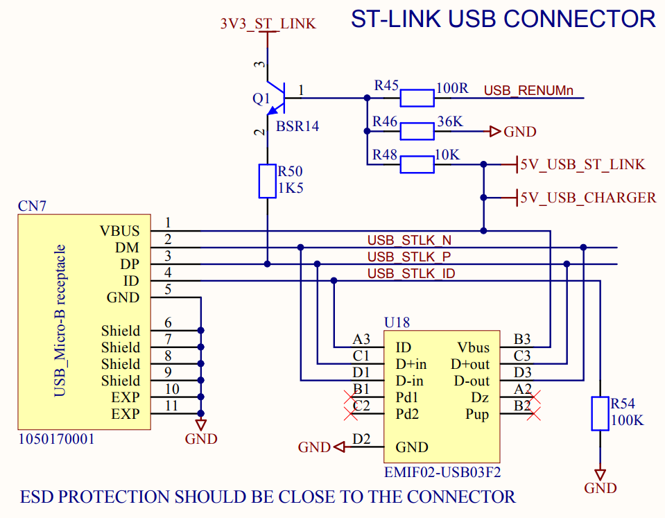  
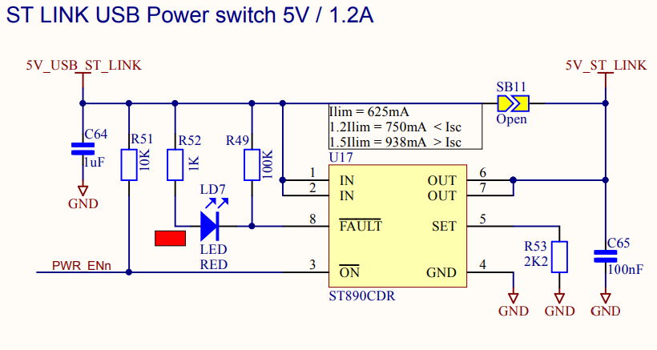  
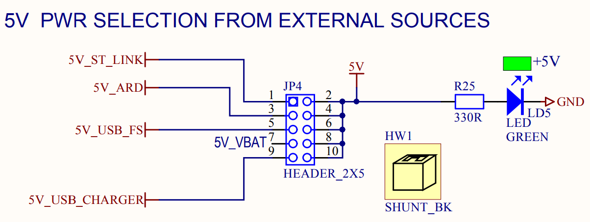  
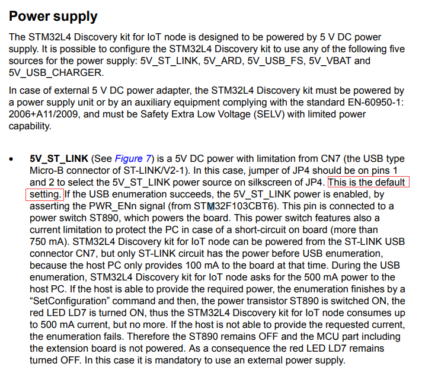  

## ST-Link

  
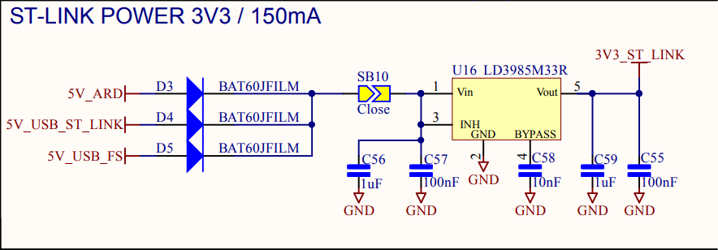  
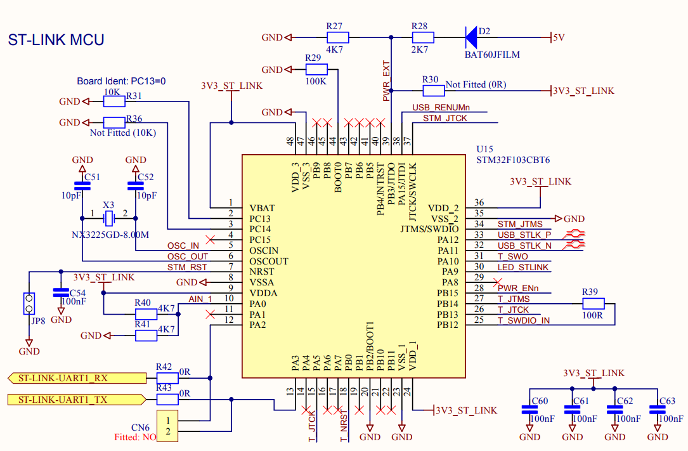  
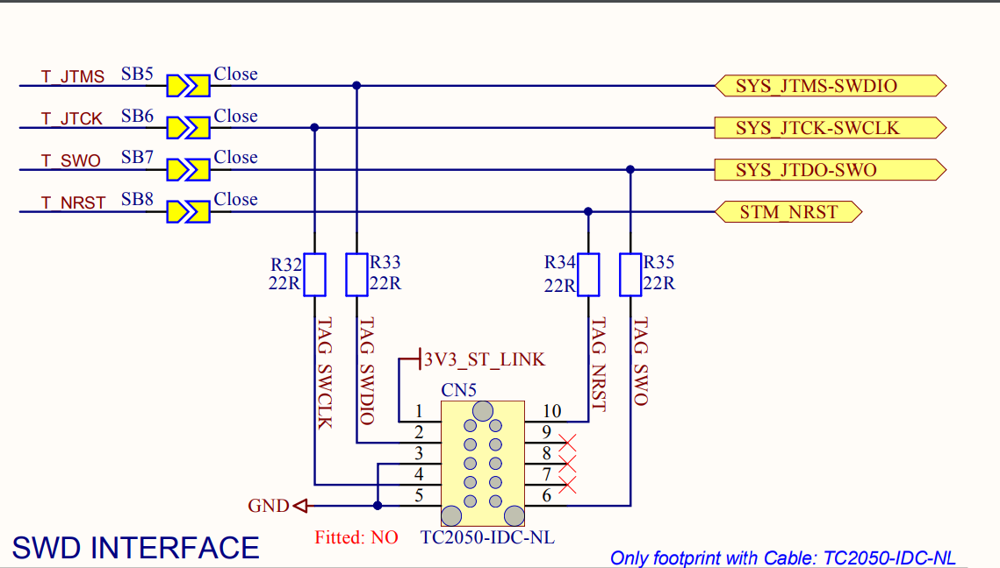  
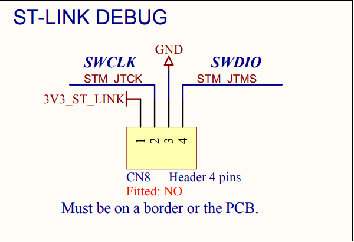  

* The EMIF02-USB03F2 is a highly integrated array designed to suppress EMI / RFI noise for USB OTG (on-the-go) ports
* The LD3985M33R is a low drop low noise BICMOS voltage regulator with an output voltage of 3.3 V and an output current up to 150 mA.
* SDW Interface:
  * 电源：CN7（Micro USB连接器） --> VBUS（5V信号线） --> 5V_USB_ST_LINK（5V信号线重命名） --> LD3985M33R(3V3稳压管) --> 3V3_ST_LINK（3V3信号线名）；
  * 烧录信号：USB信号 --> STM32F103CBT6（ST-Link主控芯片） --> SWD Interface --> CN5（留有Pin脚，可直接从这里烧录） --> STM32L475VGTx；
* ST-Link Debug：不是调试STM32L475VGTx的接口，是调试STM-Link的STM32F103CBT6的，可当做固件升级接口；

## Debug Port

Virtual COM Port（STM32F103CBT6左下角的 UART1转换成VCP）：

* ST-LINK-UART1_RX
* ST-LINK-UART1_TX

## Board expansion connectors -- PMOD Interface 

[refers/B-L475E-IOT01A/Digilent-Pmod_Interface_Specification.pdf](refers/B-L475E-IOT01A/Digilent-Pmod_Interface_Specification.pdf)

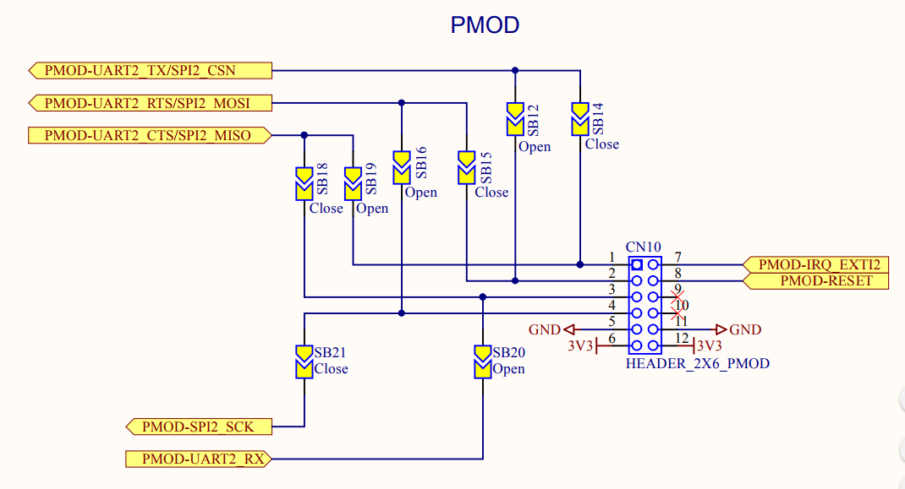  
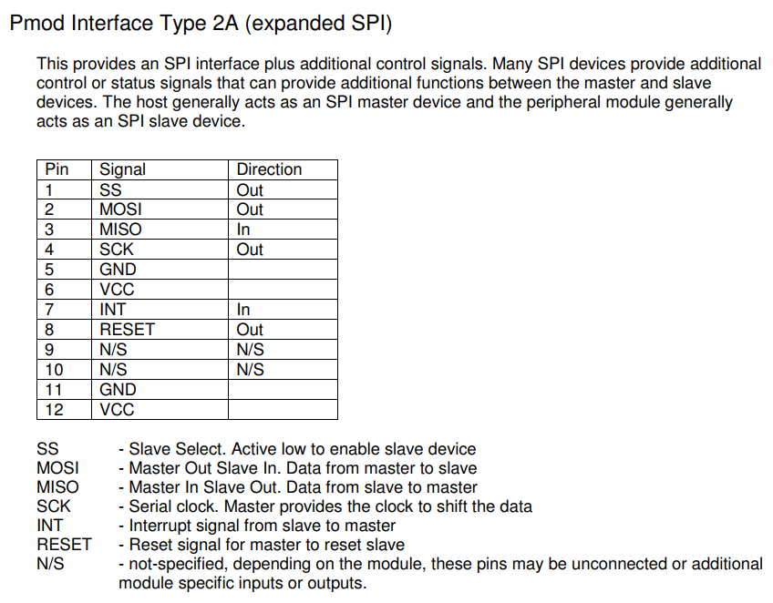  
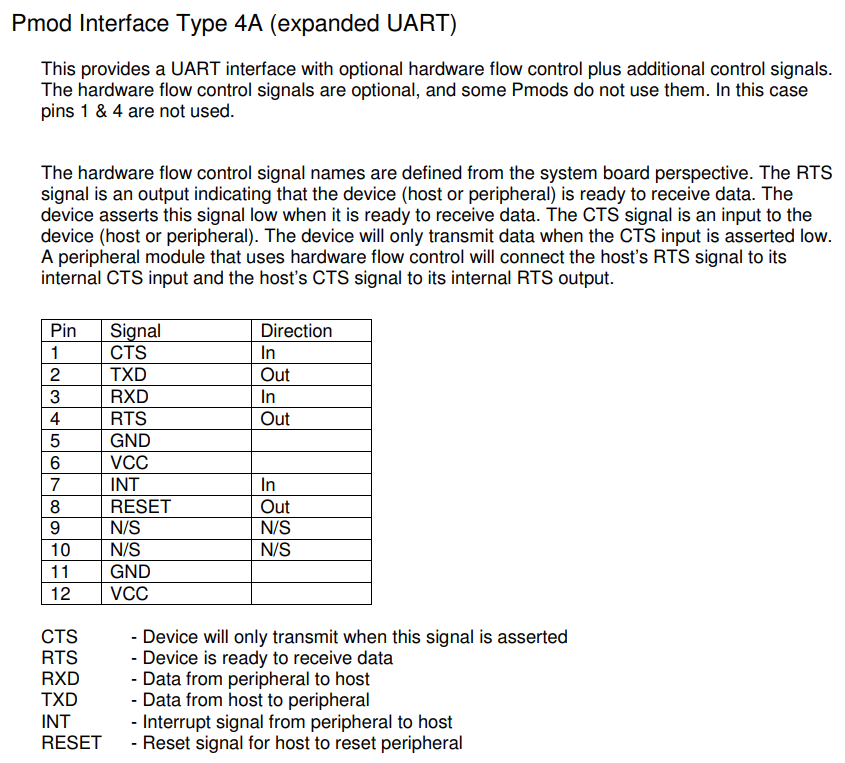  

## Arduino Uno V3 connectors

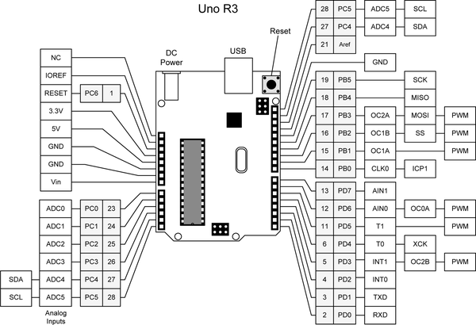  

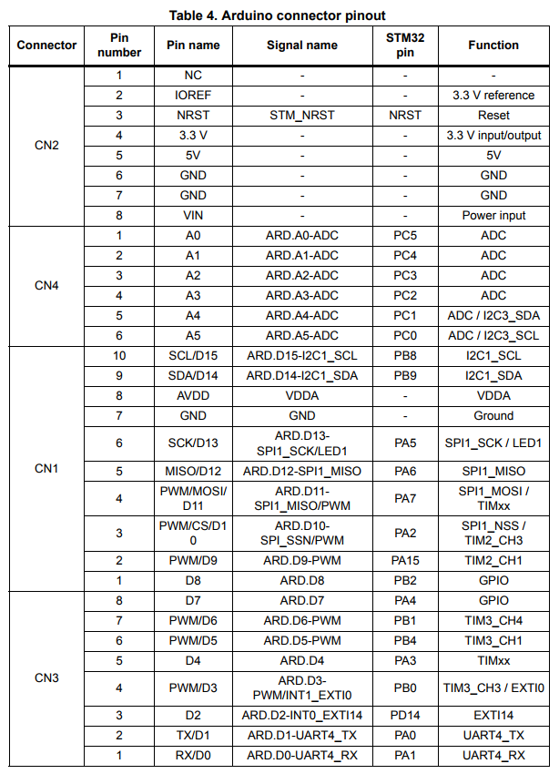

