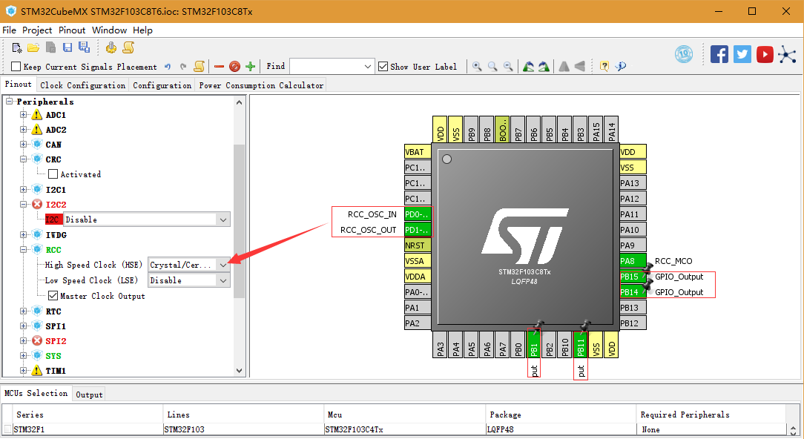
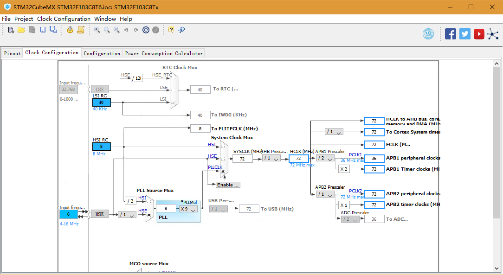
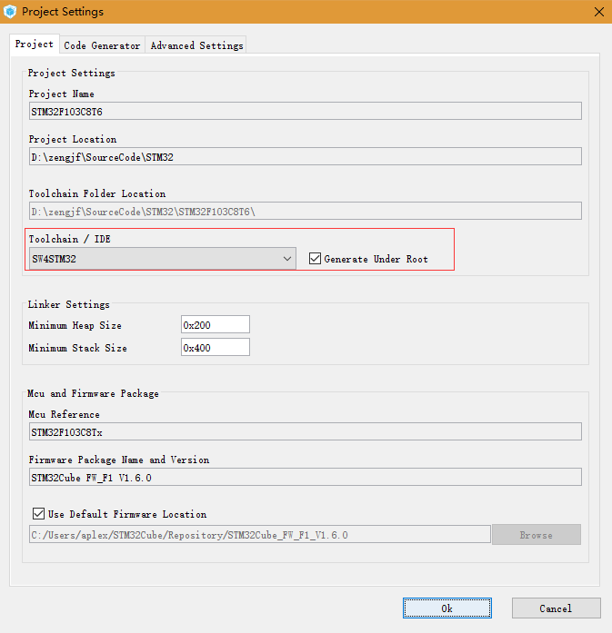
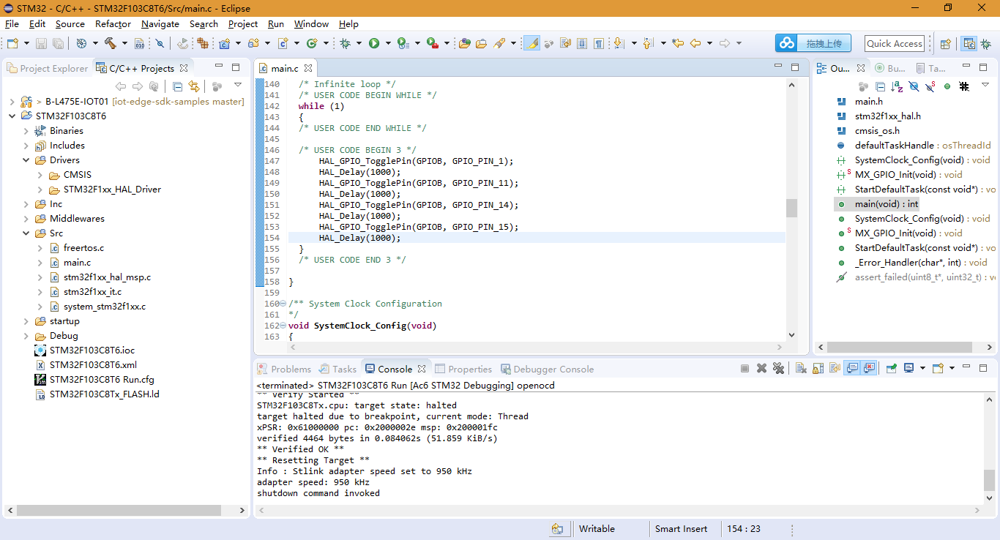
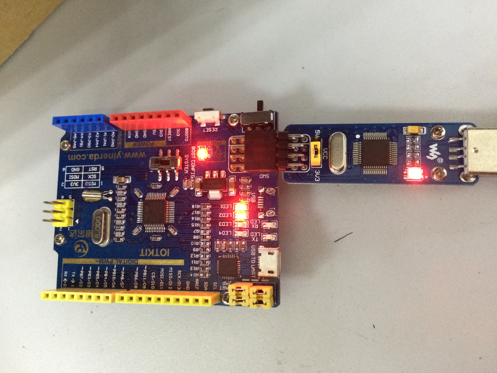

# SW4STM32 Learning

## 参考文档

[STM32CubeMX Learning](https://github.com/ZengjfOS/MiCONotes/blob/master/src/0008_STM32F103ZET6/src/019_STM32CubeMX_Learning.md)

## 原理图

GOKIT3原理图： [refers/IOT_STuino_v2.1.pdf](refers/IOT_STuino_v2.1.pdf)

## STM32CubeMX Setting

* 引脚配置：  
    
* 时钟配置：  
    
* 生成项目代码配置：  
    

接下来就是生成代码就行了。

## SW4STM32

[Source Code](code/STM32F103C8T6)

## 测试效果

