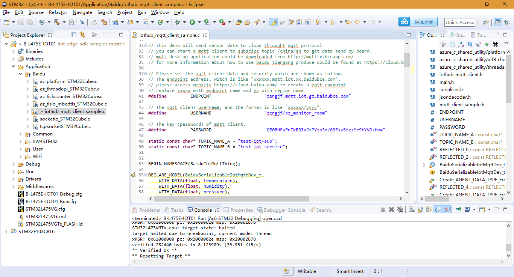

# SW4STM32 B-L475E-IOT01A Compile Download

## Complie



## Download Message

```
Open On-Chip Debugger 0.10.0-dev-00005-g4030e1c-dirty (2017-10-24-08:00)
Licensed under GNU GPL v2
For bug reports, read
	http://openocd.org/doc/doxygen/bugs.html
srst_only separate srst_nogate srst_open_drain connect_assert_srst
Info : The selected transport took over low-level target control. The results might differ compared to plain JTAG/SWD
padded zone erase set to 1
adapter_nsrst_delay: 100
adapter speed: 480 kHz
Info : clock speed 480 kHz
Error: libusb_open() failed with LIBUSB_ERROR_NOT_SUPPORTED
Info : STLINK v2 JTAG v28 API v2 M v18 VID 0x0483 PID 0x374B
Info : using stlink api v2
Info : Target voltage: 3.213639
Info : Stlink adapter speed set to 480 kHz
Info : STM32L475VGTx.cpu: hardware has 6 breakpoints, 4 watchpoints
Info : Stlink adapter speed set to 480 kHz
adapter speed: 480 kHz
STM32L475VGTx.cpu: target state: halted
target halted due to debug-request, current mode: Thread 
xPSR: 0x01000000 pc: 0x08031534 msp: 0x20002878
Info : Stlink adapter speed set to 4000 kHz
adapter speed: 4000 kHz
** Programming Started **
auto erase enabled
Info : Device id = 0x10076415
Info : STM32L4xx flash size is 1024kb, base address is 0x8000000
Info : Erase the padded zone before the write
Error: Whole bank access must start at beginning of bank.
Info : Erase the padded zone before the write
Warn : Adding extra erase range, 0x00044800 to 0x00044f17
Info : Padding image section 1 with 127208 bytes
STM32L475VGTx.cpu: target state: halted
target halted due to breakpoint, current mode: Thread 
xPSR: 0x61000000 pc: 0x20000050 msp: 0x20002878
Warn : block write succeeded
wrote 411648 bytes from file Debug/B-L475E-IOT01.elf in 11.588074s (34.691 KiB/s)
** Programming Finished **
** Verify Started **
STM32L475VGTx.cpu: target state: halted
target halted due to breakpoint, current mode: Thread 
xPSR: 0x61000000 pc: 0x2000002e msp: 0x20002878
STM32L475VGTx.cpu: target state: halted
target halted due to breakpoint, current mode: Thread 
xPSR: 0x61000000 pc: 0x2000002e msp: 0x20002878
STM32L475VGTx.cpu: target state: halted
target halted due to breakpoint, current mode: Thread 
xPSR: 0x61000000 pc: 0x2000002e msp: 0x20002878
verified 282440 bytes in 8.123989s (33.951 KiB/s)
** Verified OK **
** Resetting Target **
Info : Stlink adapter speed set to 480 kHz
adapter speed: 480 kHz
shutdown command invoked
```

## STM32L475 Terminal

```
**************************************************************************
***   STM32 IoT Discovery kit for STM32L475 MCU    ***
***   X-CUBE-Baidu Cloud Connectivity Demonstration
***   FW version 1.0.1 - Dec 26 2017, 10:06:50                         ***
**************************************************************************

*** Board personalisation ***

Press the User button (Blue) within the next 5 seconds if you want to update the configuration
(NetWork or Cloud security credentials)

Do you want to configure the Wifi credentials ? (y/n)
y
Enter SSID: CCNet

You have entered CCNet as the ssid.

Enter Security Mode (0 - Open, 1 - WEP, 2 - WPA, 3 - WPA2):3
You have entered 3 as the security mode.

Enter password: zengjfos123

*** WIFI connection ***

Initializing the WiFi module
Module initialized successfully: Inventek eS-WiFi ISM43362-M3G-L44-SPI C3.5.2.3.BETA9
Retrieving the WiFi module MAC address: c4:7f:51:04:3a:9b

Connecting to AP: CCNet  Attempt 1/3 ...
Connected to AP CCNet
Mac address: c4:7f:51:04:3a:9b
Retrieving the IP address.
IP address: 192.168.23.5
Setting the RTC from the network time.
Error: Time:Sat Jan  1 00:11:13 2000 File:D:/zengjf/SourceCode/STM32/iot-edge-sdk-samples/STM32/B-L475E-IOT01/Middlewares/Third_Party/baidu/iothub_client/src/iothub_mqtt_client.c Func:CreateRetryLogic Line:121 Not implemented chosing default
Incoming Msg: Packet Id: 0
QOS: Deliver_At_Most_Once
Topic Name: test-iot-service
Is Retained: fale
Is Duplicate: fale
App Msg: content is valid UTF8:true message length:25
publish message to topic.

call publish at least once handle
hub is connected
received publish ack from mqtt server when deliver at least once message
Incoming Msg: Packet Id: 0
QOS: Deliver_At_Most_Once
Topic Name: test-iot-sub
Is Retained: fale
Is Duplicate: fale
App Msg: content is valid UTF8:true message length:25
publish message to topic.

call publish at least once handle
hub is connected
received publish ack from mqtt server when deliver at least once message
Incoming Msg: Packet Id: 0
QOS: Deliver_At_Most_Once
Topic Name: test-iot-sub
Is Retained: fale
Is Duplicate: fale
App Msg: content is valid UTF8:true message length:217
{"magZ":380, "magY":320, "magX":-291, "gyrZ":0.000000, "gyrY":-3500.000000, "gyrX":280.000000, "accZ":1003, "accY":-6, "accX":-8, "proximity":111, "pressure":1022.539978, "humidity":44.758327, "temperature":26.056074}

call publish at least once handle
hub is connected
received publish ack from mqtt server when deliver at least once message
Incoming Msg: Packet Id: 0
QOS: Deliver_At_Most_Once
Topic Name: test-iot-sub
Is Retained: fale
Is Duplicate: fale
App Msg: content is valid UTF8:true message length:219
{"magZ":383, "magY":327, "magX":-297, "gyrZ":70.000000, "gyrY":-3570.000000, "gyrX":280.000000, "accZ":1003, "accY":-7, "accX":-11, "proximity":102, "pressure":1022.530029, "humidity":44.733875, "temperature":26.018692}

call publish at least once handle
hub is connected
received publish ack from mqtt server when deliver at least once message
Incoming Msg: Packet Id: 0
QOS: Deliver_At_Most_Once
Topic Name: test-iot-sub
Is Retained: fale
Is Duplicate: fale
App Msg: content is valid UTF8:true message length:219
{"magZ":381, "magY":321, "magX":-299, "gyrZ":140.000000, "gyrY":-3570.000000, "gyrX":210.000000, "accZ":1003, "accY":-9, "accX":-9, "proximity":111, "pressure":1022.559998, "humidity":44.703316, "temperature":26.018692}
```
